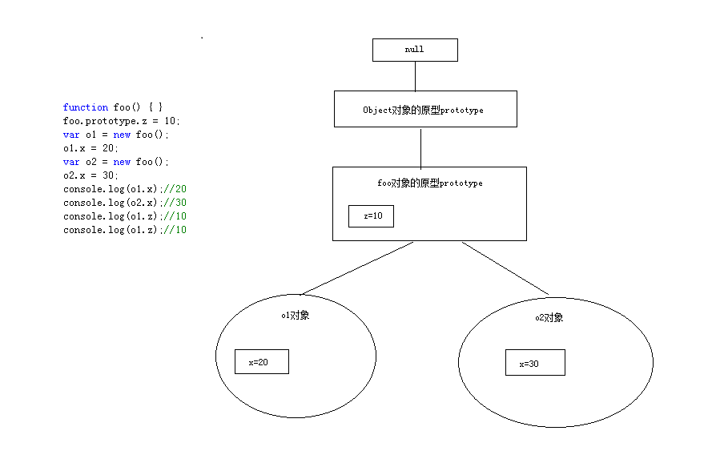

# 前言

这节主要介绍：对象的原型结构、以及如何检测对象属性。

# 对象的原型结构

要理解对象的原型结构需要配合图片来进行。

分解：

1. 从图中可以看出，每个对象都是独立的一块存储空间(o1、o2)
2. 对象是从foo原型上创建的，所以它们都公用了foo的prototype
3. foo的原型又是从Object的原型上继承下来的，所以对象（o1、o2）都有object上的一些方法和属性。
4. object的原型上没有原型了，是null

总结：

- 这就好比后端语言，类和对象的关系一样。

- 如果原型属性和对象属性存在重名，会优先使用对象属性。

- 对象属性的查找，首先查找对象本身的属性，然后在通过原型链逐步往上查找，知道找到该属性为止，找不到就是undefined。

# 检测对象属性

## in操作符检测

        function foo() { }
        //foo的原型属性
        foo.prototype.z = 10;
        var o1 = new foo();
        //对象属性
        o1.x = 20;
        var o2 = new foo();
        //对象属性
        o2.x = 30;

        //in检测，包含原型链的属性，找到属性返回true否则返回false
        console.log("x" in o1); //true
        console.log("z" in o1); //true

## hasOwnProperty方法检测

        function foo() { }
        //foo的原型属性
        foo.prototype.z = 10;
        var o1 = new foo();
        //对象属性
        o1.x = 20;
        var o2 = new foo();
        //对象属性
        o2.x = 30;

        //hasOwnProperty检测，不包含原型链的属性，找到属性返回true否则返回false
        console.log(o1.hasOwnProperty("x")); //true
        console.log(o1.hasOwnProperty("z")); //false

## Object.create

上节我们讲到四种创建对象的方式，其中Object.create的参数直接设置对象的原型。

        var o3 = Object.create({ name: "haha" });
        o3.age = 10;
        //in检测
        console.log("name" in o3); //true
        console.log("age" in o3); //true
        //hasOwnProperty检测
        console.log(o3.hasOwnProperty("name")); //false
        console.log(o3.hasOwnProperty("age")); //true

注意看两种检测方式的输出结果

# 总结

1. 理解对象原型结构
2. 学会使用in和hasOwnProperty来检测对象属性，并区分其中的区别

