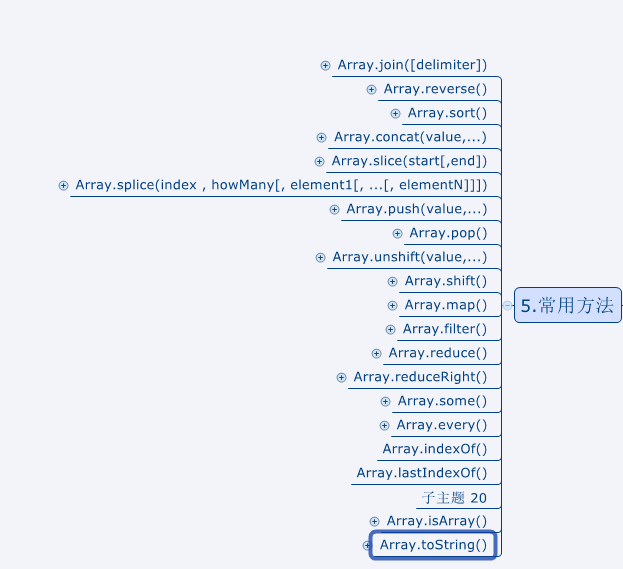

# 前言

这节介绍数组对象（Array），需要讨论的知识点有：

* 创建数组的两种方式以及如何检测数组
* 数组元素的添加
* 数组元素的修改
* 数组元素的读取
* 数组元素的删除
* 数组元素的排序
* 数组元素的位置
* 数组元素的转换
* 数组元素的归并
* 数组元素的遍历
* 其他操作方法

# 创建数组的两种方式以及如何检测数组

方式一:字面量形式

	var array = [];

方式二：构造函数形式

    

检测数组的两种方法：

    

# 数组元素的添加

添加数组元素有三种方式：下标添加，push、unshift

数组元素值可以重复，下标重复的话就是修改了。

## 使用下标添加

> 使用下标添加元素需要注意的是，数组也是对象，所以下标可以是任何类型，但是只有下标为正整数，才会自动帮我们维护length属性

    

## push添加

> push方法可以往数组末尾追加一个或一组元素，参数是动态的，可以是一个也可以是一组

    

## unshift添加

> 和push相反，unshift往数组开始位置添加一个或一组元素

    

# 数组元素的修改

修改数组中的元素只有通过下标，没有其他办法。

    

# 数组元素的读取

读取数组元素的值也只能是下标读取，这里就不做介绍了。

当然，如果下标不是正整数，那么它就是对象，可以通过对象点操作符读取

后期还有for-in等方式遍历来读取数组元素。

# 数组元素的删除

和数组添加一样，有三种方式：修改length，pop、shift

这里通过delete删除元素后，length不会自动维护，所以不要使用这种方式删除。

## 修改length

    

## pop删除

> pop方法可以删除数组末尾的一个元素，没有参数，返回值是被删除的元素

    

## shift删除

> shift方法可以删除数组开始的元素，同样没有参数，返回值是被删除的元素

    

# 数组元素的排序

> 数组排序的也有二种方式：sort、reverse

## sort排序

    

我们看到，10居然被排到了2前面，显然是不合理的，造成这种原因是因为默认的sort都会为每项调用tostring方法，在进行字符串的规则排序。所以我们需要用到自定义排序方法，比如：

    

上续方法只适用于number类型，其他类型还需要根据实际需求自定义compare函数

## reverse反转

反转就简单了，直接把数组倒过来。

    

# 数组元素的位置

可以通过indexOf和lastIndexof查找位置，这两个方法都有两个参数：

* 需要查找的元素
* 从指定下标位置查找，包含指定下标，所以需要注意使用循环时避免造成死循环

## indexOf查找位置

    

## lastIndexOf查找位置

    

# 数组元素的转换

数组的转换字符串的方法有三种：toString、valueOf、toLocaleString

## toString转换

> 经过toString方法转换的字符串，默认数组每个元素都调用toString方法（每个元素都有它对应的类型，不同类型转换为String的结果请查看类型转换章节），在进行逗号拼接。

    

## valueOf转换

调用valueOf返回的还是一个数组。就连返回地址都是原来的地址

    

可以看出，color2和color指向一块存储空间

## toLocaleString转换

> toLocaleString和toString一样，只不过toString是调用每一项的toString，而toLocaleString调用的是每项的toLocaleString方法

    

# 数组元素的归并

数组的归并方法有两个：reduce、reduceRight

都有四个参数：

* 参数一：上一个元素值
* 参数二：当前元素值
* 参数三：当前项索引
* 参数四：数组对象

## reduce归并

> 从数组的第一项遍历到最后一项，它有返回值，这个返回值都会作为第一个参数传递给下一项

    

这里我们没有返回相应的值，所以第二次后prev是undefined. 而且循环的次数使用是（数组长度-2）即（数组元素个数-1）

理解了原理之后我们可以通过归并函数来进行求总和。

    

整个过程一清二楚.归并执行完成之后再将最后一次结果返回给sum，即55.

## reduceRight归并

这个和reduce相反，它从最后一项遍历到第一项，其他的都一样

    

# 数组元素的遍历

数组的变量方式有很多种：

* for、while、do-while、for-in
* forEach ：这个方法没有返回值。
* every ：如果该函数对每一项都返回 true ，则返回 true
* some ：如果该函数对任一项返回 true ，则返回 true 。
* filter ：返回该函数会返回 true 的项组成的数组。
* map ：返回每次函数调用的结果组成的数组。

**for等普通循环遍历就不说了，它们的不好之处就是，会遍历出继承下来的元素。所以尽量有数组自身提供的遍历方法**

**instanceof只能检测对象或数组，普通类型（Number）等是无法检测的，所以使用typeof来检测，[参考文档](http://blog.csdn.net/u014421556/article/details/52083215)**

这些方法参数都一样，包含：

* 参数一：当前项
* 参数二：当前下标
* 参数三：数组对象

## forEach遍历

> 这个没啥特征，就是单纯的进行迭代

    

## every遍历

> 特征：
> 
> 当迭代中只要有一项返回false，后面将不会继续迭代了。
> 
> 最后的返回结果：只有所有项返回true，返回结果才是true

    

## some遍历

> 特征：
> 
> 当迭代中只要有一项返回true，后面将不会继续迭代了。
> 
> 最后的返回结果：只有有一项返回true，返回结果就是true

    

## filter遍历

> 特征：
> 
> 不管返回值是什么，都会遍历所有项
> 
> 最后的返回结果：返回所有**返回true的项**组成的新数组

    

## map遍历

> 特征：
> 
> 不管返回值是什么，都会遍历所有项
> 
> 最后的返回结果：返回所有返回**结果**组成的新数组

    

# 其他操作方法

数组中还有一些其他的操作方法：

* join：
* concat：
* slice：
* splice：

## join转换字符串

> 可以使用join方法指定分隔符，将数组转换为字符串。前面介绍过的转换字符串的方法有toString、toLocaleString，都不能指定其分隔符，默认是逗号，这个join方法会更加灵活

    

## concat拼接数组

> 使用concat可以拼接两个数组，返回一个全新的数组。原来的两个数组不会有任何改变。

    

## slice切割数组

> slice可以切割数组,返回被切割的元素组成的新数组，不会影响原来的数组
> 
> 参数一：开始切割的下标，切割会包含开始下标
> 
> 参数二：如果省略，将默认切割到数组结尾，否则切割到指定下标，切割不会包含结束下标

    

## splice切割并替换

> splice可以切割并替换数组,返回被切割的元素组成的新数组
> 
> 参数一：开始切割的下标，切割会包含开始下标
> 
> 参数二：需要切割N个元素
> 
> 参数三：还可以有参数四等多个参数，从参数三开始的参数都将被插入到切割的位置

    

# 总结

数组这章需要掌握的太多了，具体知识点有：

1. 字面量和构造函数两种创建数组的方式，构造函数创建时，注意一个参数和多个参数的区别
2. 检测数组可以使用instanceof或者isArray两种方式。注意：instanceof只能检测数组对象等引用类型，number等基本类型不能使用，都会返回false
3. 添加数组元素有：下标、push、unshift，注意区分push和unshift的区别
4. 删除数组元素有：修改length、pop、shift，注意区分pop和shift的区别
5. 修改数组元素有：下标
6. 读取数组元素有：下标、for、for-in、while、do-while、forEach、every、some、map、filter等等，注意区分后面五种遍历方式的区别
7. 排序数组元素有：sort、reverse
8. 查找数组元素有：indexOf、lastIndexOf。注意区分两种查找的区别，谨慎操作第二个参数，避免死循环
9. 转换数组元素有：toString、toLocaleString、valueOf、join等
10. 归并数组元素有：reduce、reduceRight，注意它们的返回值将会代入到第二次遍历中
11. 切割数组元素有：cancat、slice、splice，注意两个方法的区别，一个只切割、一个切割后还能插入新值

全部常用方法有：

