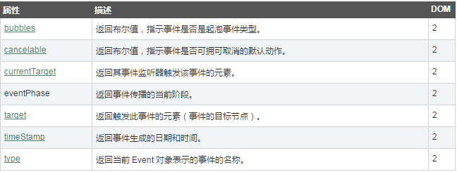
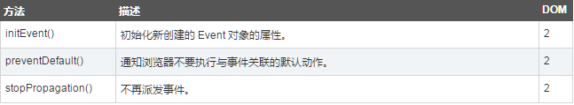

# 前言

这节讨论的知识点有：

1. 事件的兼容性
2. event对象的属性和方法

# 事件的兼容性

1. 事件绑定:addEventListener与attachEvent
2. 事件移除:removeEventListener与detachEvent
3. 获取事件对象:e.target与 window.event.srcElement
4. 阻止冒泡:e.stopPropagation与window.event.cancelBubble
5. 阻止默认:e.preventDefault与window.event.returnValue

第二种写法都是兼容IE9以下的写法，机器上也没有IE8，就不做测试了。
以下示例都是针对IE9以上或其他浏览器的代码示例

## 事件绑定和移除

前面一节学到事件有三种写法，都有不足之处，如：

1. 内联写法的缺点是紧耦合
2. 脚本写法缺点还是紧耦合
3. DOM2的写法缺点是不能同时绑定多个相同类型的事件

比如：

	<!DOCTYPE html>
	<html>
	<head>
	    <title></title>
	    
	</head>
	<body>
	    <input type="button" value="test" id="btn"/>
	</body>
	</html>

前面两个方法将会被覆盖掉，就像对象属性赋值一样，前边两个都会被修改。如果要解决这类问题需要使用addEventListener来处理

addEventListener方法有三个参数：

* 参数一：事件的类型
* 参数二：需要执行的方法
* 参数三：设置事件流的类型，值只能是true或者false，true表示事件捕获，false表示事件冒泡

		<!DOCTYPE html>
		<html>
		<head>
		    <title></title>
		    
		</head>
		<body>
		    <input type="button" value="test" id="btn"/>
		</body>
		</html>

如果需要移除事件，事件绑定时候的方法不能为匿名函数。

下面的方法是事件绑定和移除的示例：
	
	<!DOCTYPE html>
	<html>
	<head>
	    <title></title>
	    
	</head>
	<body>
	    <input type="button" value="test" id="btn"/>
	</body>
	</html>

## 阻止默认事件

什么叫阻止默认事件？

就比如说，点击了一个a标签，我们希望执行自定义的方法，还需要阻止它默认跳转。阻止默认事件的前置条件是需要event对象的cancelable属性为true。event对象稍后会介绍

示例如下：

	<!DOCTYPE html>
	<html>
	<head>
	    <title></title>
	    
	</head>
	<body>
	    <a href="http://www.baidu.com" id="test">百度一下</a>
	</body>
	</html>

## event对象的属性和方法

属性：

方法：

经过前面的章节，event对象中的方法都会用了，主要我们来介绍下event对象的属性

	<!DOCTYPE html>
	<html>
	<head>
	    <title></title>
	    
	</head>
	<body>
	    

	        <input type="button" value="百度二下" id="btn" />
	    

	</body>
	</html>

上面的代码，当我们点击按钮和点击div，输出的结果都不一样，最重要的是观察eventPhase的值。

主要需要知道：

1. currentTarget、target和this之间的相等性
2. 获取事件类型可以使用type属性
3. eventPhase有三个值，分别是：1，2，3
4. 1：代表事件是捕获阶段
5. 2：代表事件是当前阶段
6. 3：代表事件是冒泡阶段

# 总结

* 需要掌握事件的添加和移除，并设置事件流类型
* 掌握如何取消默认事件
* 掌握如何阻止事件冒泡
* 必须知道currentTarget、target和this之间的相等性
* 必须知道eventPhase的三个值分别代表什么。