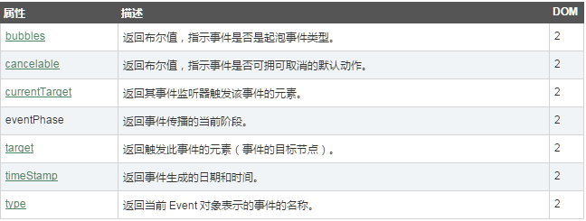
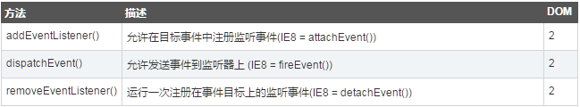
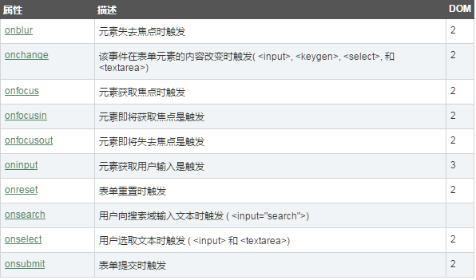
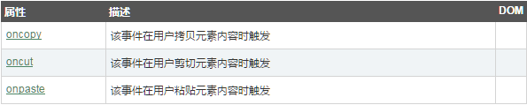
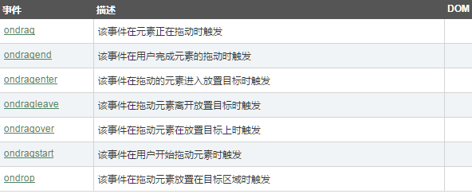
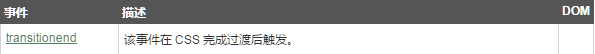
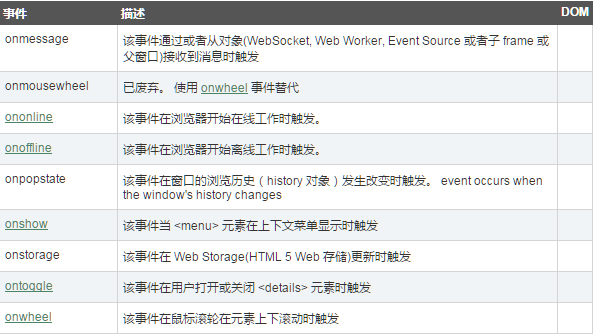
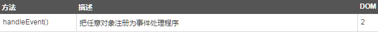
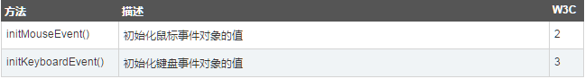

# 前言

JavaScript中的事件有很多，记是记不住的，也没有意义，这节就是将这些事件分类整理，方便用到的时候速查：

* 鼠标事件
* 键盘事件
* 事件对象Event
* 目标事件对象
* 框架/对象(Frame/Object)事件
* 表单事件
* 剪贴板事件
* 打印事件
* 拖动事件
* 动画事件
* 过渡事件
* 其它事件
* 事件监听对象
* 文档事件对象
* 鼠标/键盘事件对象

# 鼠标事件

# 键盘事件

# 事件对象Event

属性：

方法：

# 目标事件对象

# 框架/对象(Frame/Object)事件

# 表单事件

# 剪贴板事件

# 打印事件

# 拖动事件

# 动画事件

# 过渡事件

# 其它事件

# 事件监听对象

# 文档事件对象

# 鼠标/键盘事件对象

属性：

方法：

