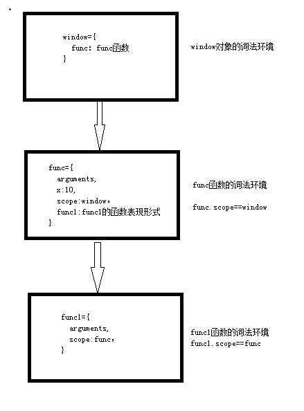

# 前言

这节讨论js的作用域链，这对后面闭包的章节很有帮助，只有理解了作用域链，才能理解闭包。

在正式开始介绍作用域链之前，需要先了解几点。

1. js中没有块级作用域。

	    

这段代码相当于：

    

# 作用域链

通过下面的代码示例进行分析来理解js中的作用域链。

    

分析：

1. 首先进行全局预处理

		window={
			func：func的函数字符串表现形式
		}

2. 调用func函数，进行函数预处理。

		func={
			arguments,
			x:undefined,
			scope:window，
			func1:func1的函数表现形式
		}

> 以函数的形式调用**(不是new对象的方式)**都会创建一个隐式的**（看不见的）**scope对象，它执行它父集的词法环境，这里就是指向window对象。func的scope等于window对象的词法环境

3. 执行func函数中的 var x=10，此时func的词法环境是

		func={
			arguments,
			x:10,
			scope:window，
			func1:func1的函数表现形式
		}

4. 调用func1(),将执行func1的函数预处理。

		func1={
			arguments,
			scope:func，
		}

> 注意这里的scope指向父集，即func的词法环境

5. 执行alert(x),当func1的词法环境中没有x变量，它将到func1的scope中寻找，还是没有那么在往上寻找。

上面的例子中最终构成的作用域链如下图：

# 封装

作用域链的好处，就是为了封装一些数据。比如，我们写了一个插件，为了不和其它js产生冲突，往往需要封装到自己的作用域链中，那么具体怎么封装呢？

    

# 总结

* 需要知道js没有块级作用域
* 理解scope已经作用域链
* 学会封装
