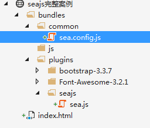

# 简介

主要学习如何使用RequireJS来解决模块化JS编程，知识点有:

1. 引入sea.js库
2. 如何变成模块 define
3. 如何调用模块sea.use exports
4. 如何依赖模块require

seajs官网地址：[https://seajs.github.io/seajs/docs/#intro](https://seajs.github.io/seajs/docs/#intro)

# seajs示例

经过前面的reuqirejs的学习，很多概念和用法都清楚了，这节就直接使用seajs来完成上节的功能了，要掌握seajs需要四部曲。

1. 引入sea.js库
2. 使用define编写模块
3. 使用sea.use调用模块
4. 使用require依赖模块

## 引入sea.js库

首先去官网下载seajs库，下载好后还是和上节一样建立一个项目，项目中用到的插件这里就不阐述了。

index.html:

	<!DOCTYPE html>
	<html>
	<head>
	    <meta http-equiv="Content-Type" content="text/html; charset=utf-8" />
	    <title></title>
	    <meta charset="utf-8" />
	</head>
	<body>
	    
	    
	</body>
	</html>

初始化工作就做完了，接下来编写入口配置文件

sea.config.js

	seajs.config({
	    base: "/bundles",
	    paths:{
	        "view": "/bundles/js",
	        "common": "/bundles/common",
	        "plugins":"/bundles/plugins"
	    },
	    alias: {
	        "jquery": "https://cdn.bootcss.com/jquery/3.2.1/jquery.min",
	        //这个不像requirejs，不能使用../返回上一层，所以基准目录设置为bundles
	        "bootstrap": "plugins/bootstrap-3.3.7/js/bootstrap.min"
	    }
	});

入口配置只要记住三个参数就行了，其它参数很少用到，用到的时候在查API，[点击查看配置的api](https://github.com/seajs/seajs/issues/262)：

* base：基准目录
* paths: 路径配置
* alias：别名配置

# 如何变成模块

sea库和入口配置的初始工作完成之后，接下来就是编写我们的模块。

语法：

	define(function (require,exports,module) {
	
	});

固定的三个参数，不能乱写或者乱命名：

* require：依赖其他模块使用
* exports：用来在模块内部对外提供接口。
* module：它是一个对象，[具体查看api](https://github.com/seajs/seajs/issues/242)
	* module.exports:与 exports 类似，用来在模块内部对外提供接口。

了解了定义模块的语法，接下来就编写自定义模块：

common/neatness.validate.js

	define(function (require,exports,module) {
	    module.exports = {
	        username: function (value) {
	            //匹配用户名,可以并只能包含数字字母下划线点或者@符号,必须以数字或者字母开头,长度大于6个字符并且不能超过30个字符
	            return /^[\w\d][\w\d\.\@]{5,29}$/.test(value);
	        },
	        password: function (value) {
	            return /^\S{6,20}$/.test(value);
	        }
	    }
	});

js/index.js:

结束。。。。seajs没法按顺序加载模块，当加载bootstrap时需要依赖jquery。它们都是并发加载，没法确定加载顺序。

折中的办法是包装bootstrap，项目中那么多的框架都要包装，累死了：

	define(function (require, exports, module) {
	    var jQuery = require('$');
	
	    // bootstrap.js源码
	});

所以还是用requirejs好。

