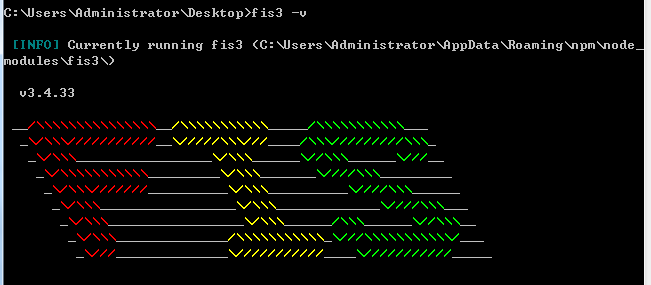

# 前言

FIS3 是面向前端的工程构建工具。解决前端工程中性能优化、资源加载（异步、同步、按需、预加载、依赖管理、合并、内嵌）、模块化开发、自动化工具、开发规范、代码部署等问题。

FIS是基于Node环境的，所以需要先安装Node，具体安装请移步至[Node环境搭建](../05/nodehuan-jing-da-jian.md)

FIS官方网站:[http://fis.baidu.com/fis3/index.html](http://fis.baidu.com/fis3/index.html)

# 额外选装cnpm

> 因为npm安装插件是从国外服务器下载，受网络影响大，可能出现异常，如果npm的服务器在中国就好了，所以我们乐于分享的淘宝团队干了这事。来自官网：“这是一个完整 npmjs.org 镜像，你可以用此代替官方版本(只读)，同步频率目前为 10分钟 一次以保证尽量与官方服务同步。

官方网址：[http://npm.taobao.org](http://npm.taobao.org)

[npm和cnpm命令介绍](http://blog.csdn.net/shelly1072/article/details/51524029)

安装命令提示符执行

	npm install cnpm -g --registry=https://registry.npm.taobao.org

安装完后最好查看其版本号cnpm -v或关闭命令提示符重新打开，安装完直接使用有可能会出现错误.

> 注：cnpm跟npm用法完全一致，只是在执行命令时将npm改为cnpm

# 安装FIS

当Node环境安装完成后，接下来可以使用npm来安装fis3了。

安装前查看可用版本：

	npm view fis3 versions --json

全局安装：

	npm install fis3 -g

全局安装完成后，会在下面的路径中看到相应的安装文件

	C:\Users\Administrator\AppData\Roaming\npm

卸载模块：

	npm uninstall fis3 -g

> * -g 安装到全局目录，必须使用全局安装，当全局安装后才能在命令行（cmd或者终端）找到 fis3 命令

> * 安装过程中遇到问题具体请参考 [fis#565](https://github.com/fex-team/fis/issues/565) 解决

> * 如果已经安装了 FIS，也执行上面的命令进行安装，FIS3 和 FIS 是不同的构建工具，向下无法完全兼容。如果要从 FIS 迁移到 FIS3，请参考文档 [FIS 升级 FIS3](http://fis.baidu.com/fis3/docs/fis2-to-fis3.html)

> * 如果 npm 长时间运行无响应，推荐使用 cnpm 来安装

验证安装并查看版本：

	fis3 -v

出现下图说明安装成功了。

