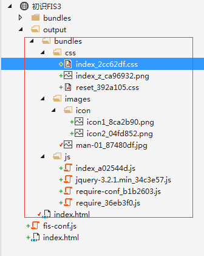

FIS3的构建不会修改源码，而是通过用户设置，将构建的结果输出到指定的目录

这篇章节只是学习笔记，讲解的内容粗略了点。

具体详细内容请参照[FIS官方文档](http://fis.baidu.com/fis3/docs/beginning/intro.html)进行学习使用。

# 配置文件

默认配置文件为根目录的 ``fis-conf.js``，FIS3 编译的整个流程都是通过配置来控制的。固化了构建流程，让工程构建变得简单。

配置语法：

	fis.match(selector, props);

参数一：文件匹配选择器，关于selector的语法请参考[Glob 说明](http://fis.baidu.com/fis3/docs/api/config-glob.html)

参数二：编译规则属性对象，[参考更多属性](http://fis.baidu.com/fis3/docs/api/config-props.html#%25E5%259F%25BA%25E6%259C%25AC%25E5%25B1%259E%25E6%2580%25A7)

> 粗滤过一下就行了，后面常用的属性使用多了自然也就知道了。

## 规则覆盖

当两条规则同时命中文件将会被覆盖，如：

	// A
	fis.match('*', {
	  release: '/dist/$0'
	});
	
	// B
	fis.match('test.js', {
	  useHash: true,
	  release: '/dist/js/$0'
	})

那么**test.js** 分配到的属性

	{
	  useHash: true, // B
	  release: '/dist/js/$0' // B
	}

## fis.media()

``fis.media()`` 接口提供多种状态功能，比如有些配置是仅供开发环境下使用，有些则是仅供生产环境使用的。

又或者：

	fis.media('rd').match('*', {
	  deploy: fis.plugin('http-push', {
	    receiver: 'http://remote-rd-host/receiver.php'
	  })
	});
	
	fis.media('qa').match('*', {
	  deploy: fis.plugin('http-push', {
	    receiver: 'http://remote-qa-host/receiver.php'
	  })
	});

* fis3 release rd push 到 RD 的远端机器上
* fis3 release qa push 到 QA 的远端机器上

> media dev 已经被占用，默认情况下不加 <media> 参数时默认为 dev

当熟悉了fis-conf.js的语法规则，以及掌握了它的两个参数属性之后，我们先通过一个例子来认识FIS3。

# 构建项目

项目目录结构：

index.html:

		<!DOCTYPE html>
		<html>
		<head>
		    <meta http-equiv="Content-Type" content="text/html; charset=utf-8" />
		    <title></title>
		    <meta charset="utf-8" />
		    <!--styles-->
		    <link href="bundles/css/reset.css" rel="stylesheet" />
		    <link href="bundles/css/index.css" rel="stylesheet" />
		    <!--styles-->
		</head>
		<body>
		    

		        <a href="#" class="site-nav-icon site-nav-icon-sign">单人游戏</a>
		        <a href="#" class="site-nav-icon site-nav-icon-more">多人游戏</a>
		    

		    
		
		    <!--scripts-->
		    
		    
		    
		    <!--scripts-->
		</body>
		</html>

index.css:

	.site-nav {
	    height: 35px;
	    background-color: #f5f5f5;
	    border-bottom: 1px solid #eee;
	    line-height: 35px;
	    padding-left: 100px;
	}
	
	.site-nav-icon-sign {
		/*要生成雪碧图，后面跟上?__sprite*/
	    background: url('../images/icon/icon1.png?__sprite') no-repeat left center;
	    padding: 10px 35px;
	    padding-right: 10px;
	}
	
	.site-nav-icon-more {
	    background: url('../images/icon/icon2.png?__sprite') no-repeat left center;
	    padding: 10px 45px;
	}

index.js:

		define(["jquery"], function ($) {
		    $(".site-nav-icon").click(function () {
		        alert($(this).text());
		    });
		});

其他的源码文件可以查看对应的源码,[对象源码如何查看在博客前言中提到过](../README.md)。

当我们正常开发阶段写好源码样式之后，此时需要在项目根目录创建``fis-conf.js``文件，并编写配置。

fis-conf.js:

	//文件携带 md5 戳
	fis.match("*.{png,jpg,css,js}", {
	    useHash:true
	});
	
	// 启用 fis-spriter-csssprites 插件
	fis.match('::package', {
	    spriter: fis.plugin('csssprites')
	});
	
	fis.match("*.js", {
	    // fis-optimizer-uglify-js 插件进行压缩，已内置
	    optimizer: fis.plugin("uglify-js")
	});
	
	// 对 CSS 进行图片合并
	fis.match('*.css', {
	    // 给匹配到的文件分配属性 `useSprite`
	    useSprite: true
	});
	
	fis.match('*.css', {
	    // fis-optimizer-clean-css 插件进行压缩，已内置
	    optimizer: fis.plugin('clean-css')
	});
	
	fis.match('*.png', {
	    // fis-optimizer-png-compressor 插件进行压缩，已内置
	    optimizer: fis.plugin('png-compressor')
	});

配置文件写好后，执行：

	fis3 release -d  ./output

这时候，结构如下图：

# 总结

这节通过配置FIS3的fis-conf.js实现了：

1. css、js、png、jpg等资源压缩
2. 雪碧图的合并
3. 文件指纹
