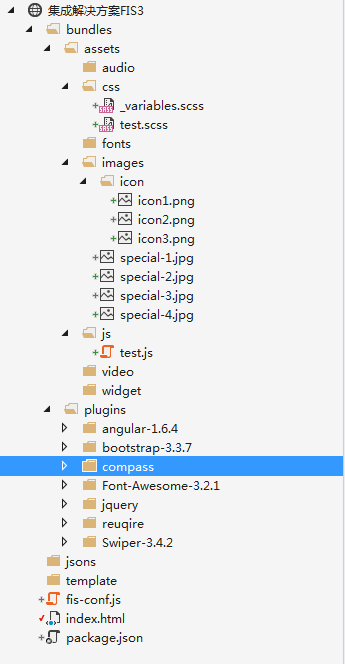
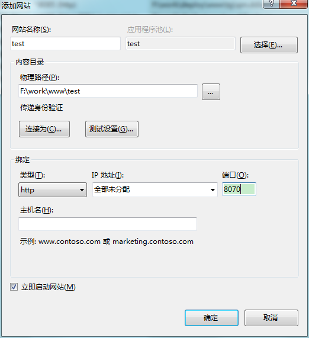

经过前面的学习，遇到了点问题，这章将一步一步来搭建适合自己的解决方案。

> 后期学习了angularjs、vuejs等框架后在重新搭建合适的解决方案。
> 
> sass参考：[我的文档之sass](https://github.com/hucemail/frontendLearning/tree/master/sass)、[w3cplus之sass](http://www.w3cplus.com/sassguide/syntax.html)、[sass中文网之sass](http://www.sasschina.com/guide/)
> 
> 当然，后期还会继续整合sass、angularjs、vuejs、reactjs系列文章。

这节主要针对如下问题：

* 支持css、js、png等图片压缩
* 支持sass、less
* 支持MD5文件指纹
* 支持CDN路径
* 支持雪碧图
* 支持EJS、handlebars模板
* 支持AMD模块化加载
* 支持页面css、js打包合并

# 搭建项目结构

首先，创建一个文件夹作为项目根目录，在执行

	npm init

初始化一个``package.json``文件后,安装下面的插件：

	npm install --save -d fis-parser-node-sass  //编译sass
	npm install --save -d fis-parser-less //编译less
	npm install --save -d fis3-postpackager-loader //文件合并
	npm install --save -d fis-parser-ejs //ejs模板
	npm install --save -d fis-parser-handlebars-3.x //handlebars模板
	npm install --save -d fis3-hook-commonjs //commonjs模块化
	npm install --save -d fis3-hook-amd //amd模块化(require.js)
	npm install --save -d fis3-hook-cmd //commonjs模块化(sea.js)

> 还有很多插件，如：``fis-parser-coffee-script``、``fis-parser-jade``等等，不使用就没必要都安装了。其他一些压缩的插件FIS3已经内置了

package.json:

	{
	  "name": "test",
	  "version": "1.0.0",
	  "description": "",
	  "main": "index.js",
	  "scripts": {
	    "test": "echo \"Error: no test specified\" && exit 1"
	  },
	  "author": "",
	  "license": "ISC",
	  "dependencies": {
	    "fis-parser-ejs": "0.0.1",
	    "fis-parser-handlebars-3.x": "0.0.1",
	    "fis-parser-less": "^0.1.3",
	    "fis-parser-node-sass": "^1.0.1",
	    "fis3-hook-amd": "^0.2.0",
	    "fis3-hook-cmd": "^0.1.2",
	    "fis3-hook-commonjs": "^0.1.26",
	    "fis3-postpackager-loader": "^2.1.4"
	  }
	}

插件安装完成后，规定下项目的目录结构。

- bundles  存放资源的根目录
	- plugins 存放第三方插件，这个目录下的资源不会被改变，所以无需参与MD5等
	- assets 存放用户自己的资源文件夹
		- audio 存放音频，如：mp3等
		- css   存放css、scss、less、sass等样式
		- fonts 存放ttf、svg等字体或矢量图文件
		- images 存放图片，如：png、jpg、jpeg、icon等等
			- icon 存放小图标，这个文件夹下的图片会被合并为一张雪碧图
	    - js  存放js文件，如果使用angularjs，可以在此目录下再次细分controllers等文件夹
	    - video 存放视频文件，如：rmvb、MP4等
	    - widget 存放一些共用的组件，如：用户自定义了正则验证，常用的工具类等
- jsons    存放json文件，通常模拟假数据
- template 存放模板

# 准备工作

在正式开始``fis-conf``配置之前，我们先来做一些事情。

首先准备一个web服务器，并搭建一个站点，这里我使用IIS

在项目根目录下创建一个index.html文件

	<!DOCTYPE html>
	<html>
	<head>
	    <meta http-equiv="Content-Type" content="text/html; charset=utf-8" />
	    <title></title>
	    <meta charset="utf-8" />
	</head>
	<body>
	    <h1>Test</h1>
	</body>
	</html>

在根目录新建``fis-conf.js`` 文件，什么都不写。接下来执行

	fis3 release -d F:\work\www\test

此时访问``http://localhost:8070/``将可以看到index页面正常输出了。

还记得上节的自动监听和自动刷新命令吗？

	fis3 release -wLd F:\work\www\test

这时候在源代码编辑器中修改index页面的内容，浏览器会自动刷新。准备工作弄完，接下来开启配置之旅吧！！！

# 配置fis-conf

根据文章顶部需要支持的功能，一小节一小节的来写FIS3的配置。在根目录新建``fis-conf.js`` 文件。

具体配置说明可以学习前面的章节或者参考：[FIS3官方文档](http://fis.baidu.com/fis3/index.html)、[Glob匹配说明](http://fis.baidu.com/fis3/docs/api/config-glob.html)、[props属性说明](http://fis.baidu.com/fis3/docs/api/config-props.html)

## 静态资源映射表

记录了文件依赖、打包、URL等信息的表结构，如果想要查看输出，可以创建，（任何位置都行，这里只是举例）``bundles/maps/manifest.json``文件

manifest.json:

	__RESOURCE_MAP__

[官方讲解](http://fis.baidu.com/fis3/docs/lv3.html#%E9%9D%99%E6%80%81%E8%B5%84%E6%BA%90%E6%98%A0%E5%B0%84%E8%A1%A8)

## 资源压缩

	/**********************生产环境配置*****************/
	//使用方法 fis3 release prod
	fis.media('prod')
	    //压缩处理
	    .match('/bundles/assets/**/*.js', {
	        optimizer: fis.plugin('uglify-js') //assets下所有js文件都会启用压缩
	    })
	    .match('/bundles/assets/**/*.{css,scss,sass,less}', {
	        optimizer: fis.plugin('clean-css')
	    })
	    .match('/bundles/assets/**/*.{png}', {
	        optimizer: fis.plugin('png-compressor')
	    });

在assets/js下创建test.js并且在页面中引用它（方便查看）。内容：

	//测试
	function Test()
	{
	    alert("xxx");
	}

执行**一定要记得prod**：

	fis3 release prod -d F:\work\www\test

这时候查看发布后的test.js，被压缩了，注释也去掉了：

	function Test(){alert("xxx")}

其他css等测试也可以使用这种办法。

## 编译sass和less

	/**********************生产环境配置*****************/
	//使用方法 fis3 release prod
	fis.media('prod')
	    //压缩处理
	    .match('/bundles/assets/**/*.js', {
	        optimizer: fis.plugin('uglify-js') //assets下所有js文件都会启用压缩
	    })
	    .match('/bundles/assets/**/*.{css,scss,sass,less}', {
	        optimizer: fis.plugin('clean-css')
	    })
	    .match('/bundles/assets/**/*.{png}', {
	        optimizer: fis.plugin('png-compressor')
	    })
	    //编译sass
	    .match('/bundles/assets/**/*.{scss,sass}', {
	        rExt: '.css',
	        parser: fis.plugin('node-sass')
	    })
	    .match('/bundles/assets/**/*.less', {
	        rExt: '.css',
	        parser: fis.plugin('less')
	    });

在assets/css下创建test.scss并且在页面中引用它（方便查看）。内容：

	@import "variables","../../plugins/compass/compass/reset","../../plugins/compass/compass/css3/border-radius";
	
	body {
	    background-color: $red; /*背景变红*/
	    h1 {
	        color: aqua;
	    }
	    img {
	        border: 10px solid #ffd800;
	        @include border-radius(10px);
	    }
	}

> 这里使用到了sass变量和mixin等特性，使用了compass

页面引用：

	<!DOCTYPE html>
	<html>
	<head>
	    <meta http-equiv="Content-Type" content="text/html; charset=utf-8" />
	    <title></title>
	    <meta charset="utf-8" />
	    <link href="bundles/assets/css/test.scss" rel="stylesheet" />
	</head>
	<body>
	    <h1>Test</h1>
	    
	    
	</body>
	</html>

执行：

	fis3 release prod -d F:\work\www\test

查看发布后的页面test.css,完美集成

## MD5文件指纹

	/**********************生产环境配置*****************/
	//使用方法 fis3 release prod
	fis.media('prod')
	    //压缩处理
	    .match('/bundles/assets/**/*.js', {
	        optimizer: fis.plugin('uglify-js') //assets下所有js文件都会启用压缩
	    })
	    .match('/bundles/assets/**/*.{css,scss,sass,less}', {
	        optimizer: fis.plugin('clean-css')
	    })
	    .match('/bundles/assets/**/*.{png}', {
	        optimizer: fis.plugin('png-compressor')
	    })
	    //编译sass
	    .match('/bundles/assets/**/*.{scss,sass}', {
	        rExt: '.css',
	        parser: fis.plugin('node-sass')
	    })
	    .match('/bundles/assets/**/*.less', {
	        rExt: '.css',
	        parser: fis.plugin('less')
	    })
	    //MD5文件指纹
	    .match('/bundles/assets/**/*', {
	        useHash: true
	    });

这时候我们可以引用一个plugins文件夹下的插件，在执行发布命令，可以发现只有assets下的资源文件被添加了MD5搓。

文件指纹是很有用的一个功能，可以[查看这篇文章](https://www.zhihu.com/question/20790576/answer/32602154)

## CDN路径

	/**********************生产环境配置*****************/
	//使用方法 fis3 release prod
	fis.media('prod')
	    //压缩处理
	    .match('/bundles/assets/**/*.js', {
	        optimizer: fis.plugin('uglify-js') //assets下所有js文件都会启用压缩
	    })
	    .match('/bundles/assets/**/*.{css,scss,sass,less}', {
	        optimizer: fis.plugin('clean-css')
	    })
	    .match('/bundles/assets/**/*.{png}', {
	        optimizer: fis.plugin('png-compressor')
	    })
	    //编译sass
	    .match('/bundles/assets/**/*.{scss,sass}', {
	        rExt: '.css',
	        parser: fis.plugin('node-sass')
	    })
	    .match('/bundles/assets/**/*.less', {
	        rExt: '.css',
	        parser: fis.plugin('less')
	    })
	    //MD5文件指纹
	    .match('/bundles/assets/**/*', {
	        useHash: true
	    })
	    //CDN
	    .match('*', {
	        domain:"http://cdn.ddianle.com/qm"
	    });

这时候再发布看看，所有的资源文件都被加了CDN地址。当然，开发的时候就没必要加CDN地址了，发布版本可以加。

## spriter雪碧图

	/**********************生产环境配置*****************/
	//使用方法 fis3 release prod
	fis.media('prod')
	    //压缩处理
	    .match('/bundles/assets/**/*.js', {
	        optimizer: fis.plugin('uglify-js') //assets下所有js文件都会启用压缩
	    })
	    .match('/bundles/assets/**/*.{css,scss,sass,less}', {
	        optimizer: fis.plugin('clean-css'),
	        useSprite: true
	    })
	    .match('/bundles/assets/**/*.{png}', {
	        optimizer: fis.plugin('png-compressor')
	    })
	    //编译sass
	    .match('/bundles/assets/**/*.{scss,sass}', {
	        rExt: '.css',
	        parser: fis.plugin('node-sass')
	    })
	    .match('/bundles/assets/**/*.less', {
	        rExt: '.css',
	        parser: fis.plugin('less')
	    })
	    //MD5文件指纹
	    .match('/bundles/assets/**/*', {
	        useHash: true
	    })
	    //CDN
	    .match('*', {
	        domain: ""
	    })
	    //打包阶段插件，//http://fis.baidu.com/fis3/docs/api/config-props.html#%25E5%259F%25BA%25E6%259C%25AC%25E5%25B1%259E%25E6%2580%25A7
	    .match('::package', {
	        spriter: fis.plugin('csssprites')
	    });

> 需要开启csssprites，并且指定useSprite: true
>
> 使用时,图片地址后跟上?__sprite

test.scss：

	@import "variables","../../plugins/compass/compass/reset","../../plugins/compass/compass/css3/border-radius";
	
	body {
	    background-color: $red; /*背景变红*/
	    h1 {
	        color: aqua;
	    }
	
	    img {
	        border: 10px solid #ffd800;
	        @include border-radius(10px);
	    }
	}
	
	.tags {
	    height: 50px;
	    background-color: #cd375e;
	    line-height: 50px;
	}
	
	.tags-item {
	    margin-left:20px;
	    color:white;
	    text-decoration:none;
	    padding:5px 25px;
	    font-size:12px;
	    border:1px solid #de7b95;
	    &:hover{
	        border:1px solid white;
	    }
	}
	.icon1{
	    background: #de7b95 url('../images/icon/icon1.png?__sprite') no-repeat 5px center;
	}
	.icon2{
	    background:#de7b95 url('../images/icon/icon2.png?__sprite') no-repeat 5px center;
	}
	.icon3{
	    background:#de7b95 url('../images/icon/icon3.png?__sprite') no-repeat 5px center;
	}

index.html

	<!DOCTYPE html>
	<html>
	<head>
	    <meta http-equiv="Content-Type" content="text/html; charset=utf-8" />
	    <title></title>
	    <meta charset="utf-8" />
	    <link href="bundles/assets/css/test.scss" rel="stylesheet" />
	</head>
	<body>
	    <h1>Test</h1>
	    

	        <a href="#" class="tags-item icon1">美妆</a>
	        <a href="#" class="tags-item icon2">唇彩</a>
	        <a href="#" class="tags-item icon3">美甲</a>
	    

	    
	    
	    
	</body>
	</html>

## 头尾部分离

> 这里使用到了FIS3的资源定位，[可以参考:http://fis.baidu.com/fis3/docs/user-dev/extlang.html](http://fis.baidu.com/fis3/docs/user-dev/extlang.html),当中介绍了在html、css、js中内嵌资源、定位资源.

这时候要提取共用的头部和尾部，在template文件夹下新增_header.html

	

	    <a href="#" class="tags-item icon1">美妆</a>
	    <a href="#" class="tags-item icon2">唇彩</a>
	    <a href="#" class="tags-item icon3">美甲</a>
	

index.html:

	<!DOCTYPE html>
	<html>
	<head>
	    <meta http-equiv="Content-Type" content="text/html; charset=utf-8" />
	    <title></title>
	    <meta charset="utf-8" />
	    <link href="bundles/assets/css/test.scss" rel="stylesheet" />
	</head>
	<body>
	    <h1>Test</h1>
	    <link rel="import" href="template/_header.html?__inline" />
	    
	    
	    
	</body>
	</html>

> 使用 ``<link rel="import" href="template/_header.html?__inline" />``来包含，后面带__inline。

## 模块化加载

> js的模块化分为三种,不清楚模块化可以查看[JavaScript模块化](../03/README.md)。这里的例子主要以amd的require为主。
> 
> 期间使用了[fis3-postpackager-loader插件](https://github.com/fex-team/fis3-postpackager-loader)来进行__RESOURCE_MAP__解决模块资源加载问题

	/**********************生产环境配置*****************/
	//使用方法 fis3 release prod
	fis.media('prod')
	    //压缩处理
	    .match('/bundles/assets/**/*.js', {
	        optimizer: fis.plugin('uglify-js') //assets下所有js文件都会启用压缩
	    })
	    .match('/bundles/assets/**/*.{css,scss,sass,less}', {
	        optimizer: fis.plugin('clean-css'),
	        useSprite: true
	    })
	    .match('/bundles/assets/**/*.{png}', {
	        optimizer: fis.plugin('png-compressor')
	    })
	    //编译sass
	    .match('/bundles/assets/**/*.{scss,sass}', {
	        rExt: '.css',
	        parser: fis.plugin('node-sass')
	    })
	    .match('/bundles/assets/**/*.less', {
	        rExt: '.css',
	        parser: fis.plugin('less')
	    })
	    //MD5文件指纹
	    .match('/bundles/assets/**/*', {
	        useHash: true
	    })
	    //CDN
	    .match('*', {
	        domain: ""
	    })
	    //打包阶段插件
	    .match('::package', {
	        spriter: fis.plugin('csssprites'),
	        //使用了文件指纹之后必须分析 __RESOURCE_MAP__ 结构来解决模块化加载，否则会出问题
	        postpackager: fis.plugin('loader', {
	            resourceType: 'amd',
	            resoucemap: "/bundles/maps/${filepath}_map.js"
	        })
	    })
	    //amd模块化
	    .hook('amd', {
	        baseUrl: "bundles/assets/js",
	        paths: {
	            "jquery": "/bundles/plugins/jquery/jquery.min",
	            "swiper": "/bundles/plugins/Swiper-3.4.2/dist/js/swiper.min",
	            "angular": "/bundles/plugins/angular-1.6.4/angular.min",
	            "bootstrap": "/bundles/plugins/bootstrap-3.3.7/js/bootstrap.min"
	        },
	        shim:{
	            "bootstrap": {
	                "deps": ["jquery"]
	            }
	        }
	    })
	    //plugins插件目录下的脚本不包装define
	    .match('/bundles/plugins/**.js', {
	        isMod: false
	    });

经过前面这些配置之后，现在配置越来越大了。。。其中模块化的配置也是最难的。

    //打包阶段插件
    .match('::package', {
        spriter: fis.plugin('csssprites'),
        //使用了文件指纹之后必须分析 __RESOURCE_MAP__ 结构来解决模块化加载，否则会出问题
        postpackager: fis.plugin('loader', {
            resourceType: 'amd',
            resoucemap: "/bundles/maps/${filepath}_map.js"
        })
    })
    //amd模块化
    .hook('amd', {
        baseUrl: "bundles/assets/js",
        paths: {
            "jquery": "/bundles/plugins/jquery/jquery.min",
            "swiper": "/bundles/plugins/Swiper-3.4.2/dist/js/swiper.min",
            "angular": "/bundles/plugins/angular-1.6.4/angular.min",
            "bootstrap": "/bundles/plugins/bootstrap-3.3.7/js/bootstrap.min"
        },
        shim:{
            "bootstrap": {
                "deps": ["jquery"]
            }
        }
    })
    //plugins插件目录下的脚本不包装define
    .match('/bundles/plugins/**.js', {
        isMod: false
    })

主要配置如上，注释写的很清楚了，学习过``require.js``的话也不难理解。

使用方法和``require.js``的一模一样,可以找到本章的源码发布后查看相应的效果和目录结构。

## 页面css、js打包合并

> 基于页面方式的打包使用的还是fis3-postpackager-loader插件

            //基于页面打包方式
            allInOne: {
                js: function (file) {
                    return "/bundles/assets/packings/" + file.filename + "_aio.js";
                },
                css: function (file) {
                    return "/bundles/assets/packings/" + file.filename + "_aio.css";
                },
                includeAsyncs: true,
                ignore: ["/bundles/plugins/**"]
            }

看下插件的文档，这些配置也挺简单的。

# 总结

## 完整的fis-conf

	//压缩处理
	fis.match('/bundles/assets/**/*.js', {
	    optimizer: fis.plugin('uglify-js') //assets下所有js文件都会启用压缩
	})
	    .match('/bundles/assets/**/*.{css,scss,sass,less}', {
	        optimizer: fis.plugin('clean-css'),
	        useSprite: true
	    })
	    .match('/bundles/assets/**/*.{png}', {
	        optimizer: fis.plugin('png-compressor')
	    })
	    //编译sass
	    .match('/bundles/assets/**/*.{scss,sass}', {
	        rExt: '.css',
	        parser: fis.plugin('node-sass')
	    })
	    .match('/bundles/assets/**/*.less', {
	        rExt: '.css',
	        parser: fis.plugin('less')
	    })
	    //打包阶段插件
	    .match('::package', {
	        spriter: fis.plugin('csssprites'),
	        //使用了文件指纹之后必须分析 __RESOURCE_MAP__ 结构来解决模块化加载，否则会出问题
	        postpackager: fis.plugin('loader', {
	            resourceType: 'amd',
	            resoucemap: "/bundles/assets/packings/${filepath}_map.js",
	            //基于页面打包方式
	            allInOne: {
	                js: function (file) {
	                    return "/bundles/assets/packings/" + file.filename + "_aio.js";
	                },
	                css: function (file) {
	                    return "/bundles/assets/packings/" + file.filename + "_aio.css";
	                },
	                includeAsyncs: true,
	                ignore: ["/bundles/plugins/**"]
	            }
	        })
	    })
	    //amd模块化
	    .hook('amd', {
	        baseUrl: "bundles/assets/js",
	        paths: {
	            "jquery": "/bundles/plugins/jquery/jquery.min",
	            "swiper": "/bundles/plugins/Swiper-3.4.2/dist/js/swiper.min",
	            "angular": "/bundles/plugins/angular-1.6.4/angular.min",
	            "bootstrap": "/bundles/plugins/bootstrap-3.3.7/js/bootstrap.min"
	        },
	        shim: {
	            "bootstrap": {
	                "deps": ["jquery"]
	            }
	        }
	    })
	    //plugins插件目录下的脚本不包装define
	    .match('/bundles/plugins/**.js', {
	        isMod: false
	    });
	
	/**********************生产环境配置*****************/
	//使用方法 fis3 release prod
	fis.media('prod')//CDN
	    .match('*', {
	        domain: "http://www.cnd.com"
	    })
	    //MD5文件指纹
	    .match('/bundles/assets/**', {
	        useHash: true
	    });

## 使用命令

开发版本(没有加入CDN和MD5)：

	fis3 release -d F:\work\www\test

发布版本（加入了CDN和MD5）：

	fis3 release prod -d F:\work\www\test

自动监听刷新：

	fis3 release prod -wLd F:\work\www\test