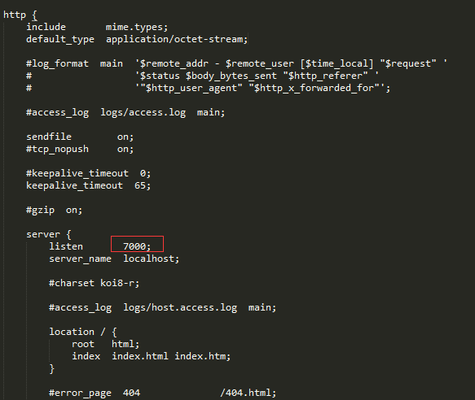
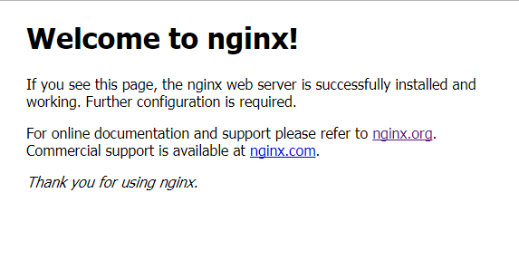

# 前言

> [参考文章：配置nginx实现windows/iis应用负载均衡](http://www.cnblogs.com/guwei4037/p/6692984.html?utm_source=itdadao&utm_medium=referral)、[Nginx反向代理，负载均衡，redis session共享，keepalived高可用](http://www.cnblogs.com/mrlinfeng/p/6146866.html)

使用Nginx有很多好处，如：

* 反向代理
* 配合IIS或Tomcat等web服务器实现负载均衡

# 下载

nginx官方网站：[http://nginx.org/](http://nginx.org/)，可以在网站上面进行下载。

一定要下载稳定版本，文章下载的版本是**nginx-1.12.1.zip**，下载解压后看到的nginx如下目录：

接下来在根目录下运行

	start nginx.exe

默认监听80端口，我的80端口被占用了。可以修改nginx.conf来改变监听端口（稍后会介绍nginx.conf配置），这里就改为7000吧。

这时候打开：[http://localhost:7000/](http://localhost:7000/),会看到：

停止nginx：

	nginx -s stop

修改配置后重启：

	nginx -s reload

# 配置

nginx的配置在conf目录下的nginx.conf文件，我们打开nginx.conf文件。这时会看到有80行的样子吧，可以把默认的注释都删掉**(#号开头的都是注释)**

nginx.conf:

	worker_processes  1;
	events {
	    worker_connections  1024;
	}
	http {
	    include       mime.types;
	    default_type  application/octet-stream;
	    keepalive_timeout  65;
	    server {
	        listen       7000;
	        server_name  localhost;
	        location / {
	            root   html;
	            index  index.html index.htm;
	        }
	    }
	}

## 反向代理

> 反向代理意思是请求转发。如下配置：
> 
> 当访问localhost:7000是其实访问的是http://uu.ddianle.com
> 
> 当访问localhost:7001是其实访问的是http://localhost:9001
> 
> 这里需要注意：$host 和 $http_host 是指向你自己的机器的。要代理到其他网站， HTTP Header 里的 Host 就要设置成目标站点的域名，这样请求发到目标站点，目标站点的 Web 服务器才能正确处理请求。
> $proxy_host才是反代的那个 host 

	worker_processes  1;
	events {
	    worker_connections  1024;
	}
	http {
	    include       mime.types;
	    default_type  application/octet-stream;
	    keepalive_timeout  65;
	    server {
	        listen       7000;
	        server_name  localhost;
	        location / {
	             #设置主机头和客户端真实地址，以便服务器获取客户端真实IP
	             proxy_set_header Host uu.ddianle.com;
	             proxy_set_header X-Real-IP $remote_addr;
	             proxy_set_header X-Forwarded-For $proxy_add_x_forwarded_for;
	             #反向代理的地址
	             proxy_pass http://uu.ddianle.com;    
	             proxy_redirect default; 
	        }
	    }
	    server {
	        listen       7001;
	        server_name  localhost;
	        location / {
	             #设置主机头和客户端真实地址，以便服务器获取客户端真实IP
	             proxy_set_header Host  $host;
	             proxy_set_header X-Real-IP $remote_addr;
	             proxy_set_header X-Forwarded-For $proxy_add_x_forwarded_for;
	             #反向代理的地址
	             proxy_pass http://localhost:9001/frontend/;    
	             proxy_redirect default; 
	        }
	    }
	}

## 负载均衡

	worker_processes  1;
	    events {
	        worker_connections  1024;
	    }
	
	    http {
	        include       mime.types;
	        default_type  application/octet-stream;
	        keepalive_timeout  65;
	
	        upstream local-ddianle {
	             server 172.16.6.17:9000;
	             server 172.16.6.21:7003;
	        }
	
	        server {
	            listen       7001;
	            server_name  localhost;
	            location / {
	                 #设置主机头和客户端真实地址，以便服务器获取客户端真实IP
	                 proxy_set_header Host  $host;
	                 proxy_set_header X-Real-IP $remote_addr;
	                 proxy_set_header X-Forwarded-For $proxy_add_x_forwarded_for;
	                 #反向代理的地址
	                 proxy_pass http://local-ddianle;    
	                 proxy_redirect default; 
	            }
	        }
	    }

集群负载之后，注意请求客户端的IP地址方式以及session共存需要配置radis来进行：

    protected void Page_Load(object sender, EventArgs e)
    {
        this.Label0.Text = "请求开始时间：" + DateTime.Now.ToString("yyyy-MM-dd HH:mm:ss");
        this.Label1.Text = "服务器名称：" + base.Server.MachineName;
        this.Label2.Text = "服务器IP地址：" + base.Request.ServerVariables["LOCAL_ADDR"];
        this.Label3.Text = "HTTP访问端口：" + base.Request.ServerVariables["SERVER_PORT"];
        this.Label4.Text = string.Concat(new object[] { ".NET解释引擎版本：.NET CLR", Environment.Version.Major, ".", Environment.Version.Minor, ".", Environment.Version.Build, ".", Environment.Version.Revision });
        this.Label5.Text = "服务器操作系统版本：" + Environment.OSVersion.ToString();
        this.Label6.Text = "服务器IIS版本：" + base.Request.ServerVariables["SERVER_SOFTWARE"];
        this.Label7.Text = "服务器域名：" + base.Request.ServerVariables["SERVER_NAME"];
        this.Label8.Text = "虚拟目录的绝对路径：" + base.Request.ServerVariables["APPL_RHYSICAL_PATH"];
        this.Label9.Text = "执行文件的绝对路径：" + base.Request.ServerVariables["PATH_TRANSLATED"];
        this.Label10.Text = "虚拟目录Session总数：" + this.Session.Contents.Count.ToString();
        this.Label11.Text = "虚拟目录Application总数：" + base.Application.Contents.Count.ToString();
        this.Label12.Text = "域名主机：" + base.Request.ServerVariables["HTTP_HOST"];
        this.Label13.Text = "服务器区域语言：" + base.Request.ServerVariables["HTTP_ACCEPT_LANGUAGE"];
        this.Label14.Text = "用户信息：" + base.Request.ServerVariables["HTTP_USER_AGENT"];
        this.Label14.Text = "CPU个数：" + Environment.GetEnvironmentVariable("NUMBER_OF_PROCESSORS");
        this.Label15.Text = "CPU类型：" + Environment.GetEnvironmentVariable("PROCESSOR_IDENTIFIER");
        this.Label16.Text = "请求来源地址：" +base.Request.UserHostAddress;
        this.Label17.Text = "请求来源地址X-Real-IP：" + base.Request.Headers["X-Real-IP"];
        
    }

## 其他配置

当集群后，其中一台服务器宕机怎么办？？

还有其他很多配置：

静态资源缓存，重定向等，想深入的童鞋请自行学习

nginx配置详解：[http://blog.csdn.net/tjcyjd/article/details/50695922](http://blog.csdn.net/tjcyjd/article/details/50695922)