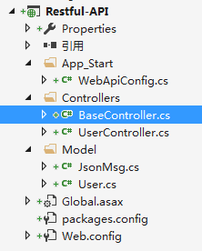

# 前言

这小节介绍ng-的一些指令，有如下：

* ng-app:模块
* ng-controller：控制器
* ng-cloak：解决闪屏
* ng-model:绑定元素值，用于表单
* ng-bind:绑定元素值
* ng-value：绑定元素值，可写表达式
* ng-show：为true显示，false则隐藏
* ng-hide：为false显示，true则隐藏
* ng-if：为true执行，false则不执行
* ng-true-value：为true时使用的值
* ng-false-value：为false时使用的值
* ng-options:用于操作下拉列表
* ng-click:点击事件
* ng-repeat:遍历
* ng-src：
* ng-href:
* ng-class：
* ng-style：

这节通过构建一个增删改查用户信息的例子来演示，这些指令通通都用上。

# 使用MVC创建Restful-API

创建一个空的``web-api 2.0`` 的项目

WebApiConfig.cs

	using System;
	using System.Collections.Generic;
	using System.Linq;
	using System.Net.Http.Formatting;
	using System.Web.Http;
	using System.Web.Http.Cors;
	
	namespace Restful_API
	{
	    public static class WebApiConfig
	    {
	        public static void Register(HttpConfiguration config)
	        {
	            // Web API configuration and services
	            #region 跨域配置
	            //webapi 跨域的支持请参考：http://www.cnblogs.com/moretry/p/4154479.html  http://www.cnblogs.com/landeanfen/p/5177176.html
	            //nuget 安装Microsoft.AspNet.WebApi.Cors
	            //Install-Package Microsoft.AspNet.WebApi.Cors
	            //config.EnableCors(new EnableCorsAttribute("*", "*", "*"));//允许所有跨域
	
	            var allowOrigins = "http://127.0.0.1:9000";//获取允许访问资源的源。http://www.baidu.com,http://www.taobao.com
	            var allowHeaders = "*";//获取资源支持的标头。
	            var allowMethods = "*";//获取资源支持的方法。
	            var globalCors = new EnableCorsAttribute(allowOrigins, allowHeaders, allowMethods);
	            config.EnableCors(globalCors);
	            #endregion
	
	
	            #region 默认返回json类型配置
	            GlobalConfiguration.Configuration.Formatters.XmlFormatter.SupportedMediaTypes.Clear();
	            GlobalConfiguration.Configuration.Formatters.JsonFormatter.MediaTypeMappings.Add(
	                new QueryStringMapping("datatype", "json", "application/json"));
	            GlobalConfiguration.Configuration.Formatters.XmlFormatter.MediaTypeMappings.Add(
	                new QueryStringMapping("datatype", "xml", "application/xml"));
	            #endregion
	
	            // Web API routes
	            config.MapHttpAttributeRoutes();
	
	            config.Routes.MapHttpRoute(
	                name: "DefaultApi",
	                routeTemplate: "api/{controller}/{id}",
	                defaults: new { id = RouteParameter.Optional }
	            );
	        }
	    }
	}

Model/JsonMsg.cs

	using System;
	using System.Collections.Generic;
	using System.Linq;
	using System.Web;
	
	namespace Restful_API.Model
	{
	    public class JsonMsg<T>
	    {
	        public int status { get; set; }
	        public string message { get; set; }
	        public T data { get; set; }
	    }
	    public class JsonMsg
	    {
	        public int status { get; set; }
	        public string message { get; set; }
	        public object data { get; set; }
	    }
	}

Model/User.cs

	using System;
	using System.Collections.Generic;
	using System.Linq;
	using System.Web;
	
	namespace Restful_API.Model
	{
	    /// 

	    /// 用户信息
	    /// 

	    public class User
	    {
	        public int userid { get; set; }
	        public string username { get; set; } //用户名
	        public string password { get; set; }//密码
	        public string nickname { get; set; }//昵称
	        public EGender gender { get; set; }//男OR女
	        public string hobby { get; set; }//爱好
	        public string province { get; set; }//省
	        public string city { get; set; }//市
	        public string county { get; set; }//区县
	        public string street { get; set; }//街道
	    }
	    public enum EGender
	    {
	        man,
	        woman
	    }
	}

BaseController.cs

	using Restful_API.Model;
	using System;
	using System.Collections.Generic;
	using System.Linq;
	using System.Net;
	using System.Net.Http;
	using System.Web.Http;
	
	namespace Restful_API.Controllers
	{
	    public class BaseController : ApiController
	    {
	        protected JsonMsg<T> ConvertJsonMsg<T>( T data, int status = 0, string message ="")
	        {
	            return new JsonMsg<T>() { data = data, message = message, status = status };
	        }
	        protected JsonMsg ConvertJsonMsg(object data, int status = 0, string message = "")
	        {
	            return new JsonMsg() { data= data,message = message, status = status };
	        }
	    }
	}

UserController.cs

	using Restful_API.Model;
	using System;
	using System.Collections.Generic;
	using System.Linq;
	using System.Net;
	using System.Net.Http;
	using System.Web.Http;
	
	namespace Restful_API.Controllers
	{
	    [RoutePrefix("api/user")]
	    public class UserController : BaseController
	    {
	        private static List<User> users = new List<User>();
	        
	        private int GenerateUserID()
	        {
	            return (int)(DateTime.Now - (new DateTime(1970, 1, 1))).TotalSeconds;
	        }
	
	        [HttpPost]
	        [HttpGet]
	        [Route("getalluser")]
	        public JsonMsg<List<User>>  GetAllUser()
	        {
	            return ConvertJsonMsg<List<User>>(users);
	        }
	
	        [HttpPost]
	        [HttpGet]
	        [Route("getuser")]
	        public JsonMsg<User> GetUser(int userid)
	        {
	            var data = (from u in users where u.userid.Equals(userid) select u).FirstOrDefault();
	            if (data == null) return ConvertJsonMsg<User>(data, 1, "用户不存在");
	            return ConvertJsonMsg<User>(data);
	        }
	
	        [HttpPost]
	        [Route("regiest")]
	        public JsonMsg Regiest(User user)
	        {
	            if (user == null) return ConvertJsonMsg(null, 1, "参数传递错误");
	            user.userid = GenerateUserID();
	            users.Add(user);
	            return ConvertJsonMsg(null);
	        }
	
	        [HttpPost]
	        [Route("delete")]
	        public JsonMsg Delete(int userid)
	        {
	            var data = (from u in users where u.userid.Equals(userid) select u).FirstOrDefault();
	            if (data == null) return ConvertJsonMsg(null, 1, "用户不存在");
	            return users.Remove(data) ? ConvertJsonMsg(null) : ConvertJsonMsg(null,2,"删除失败");
	        }
	
	        [HttpPost]
	        [Route("update")]
	        public JsonMsg Update(User user)
	        {
	            if (user == null) return ConvertJsonMsg(null, 1, "参数传递错误");
	
	            var data = (from u in users where u.userid.Equals(user.userid) select u).FirstOrDefault();
	            if (data == null) return ConvertJsonMsg(null, 2, "用户不存在");
	            users.Remove(data);
	
	            users.Add(user);
	            return ConvertJsonMsg(null);
	        }
	    }
	}

具体请查看源码，api写好之后部署到IIS中，这里接口地址使用的是：http://127.0.0.1:9002

# 创建前端项目

接口写好之后，现在创建前端项目。为了简单起见，就不用require.js和FIS3这些了，这节只是为了介绍如何使用AngularJS的这些指令

