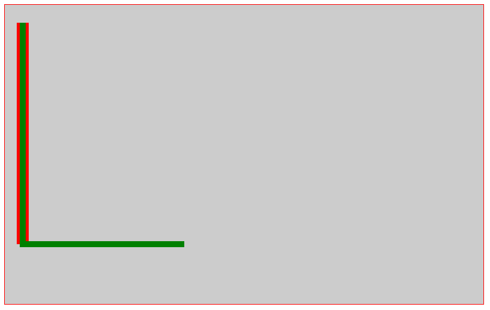
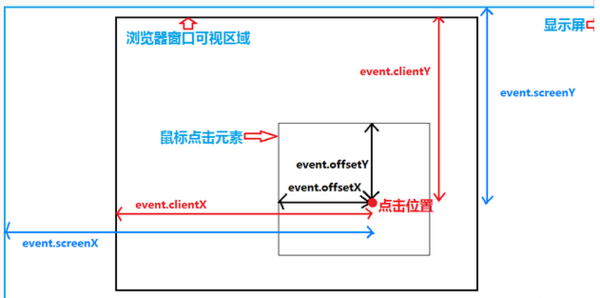
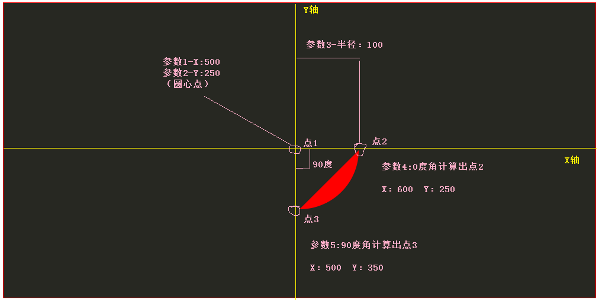
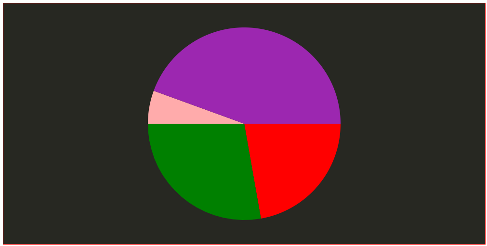

# 前言

> canvas相当于一块画布，可以利用一些原生的js-api接口在画布中绘制图形。
> 
> [绘图相关的API查询手册](https://developer.mozilla.org/zh-CN/docs/Web/API/CanvasRenderingContext2D)

本节知识点有：

* 绘制矩形
* 绘制线条
* 保存和恢复画笔状态
* 画画板
* 绘制圆形
* 绘制饼状图
* 绘制文字
* 插入图片
* 画布效果
* 图片填充
* 获得图片数据

# 绘制矩形

**API:**

* fillStyle：填充样式
* fillRect：填充矩形
* clearRect：搽除矩形
* ------------------------------
* lineWidth：线条宽度
* strokeStyle：线条样式
* strokeRect:线条矩形

---

	<!DOCTYPE html>
	<html>
	<head>
	    <meta http-equiv="Content-Type" content="text/html; charset=utf-8" />
	    <title></title>
	    <meta charset="utf-8" />
	    
	</head>
	<body>
	    <canvas width="800" height="500" id="canvas"></canvas>
	    
	</body>
	</html>

# 绘制线条

**API:**

* beginPath:开启路径，相当于按下画笔
* moveTo：指定画笔的起始位置
* lineTo：指定线条的结束位置
* stroke：绘制线条
* fill：填充
* closePath：关闭路径，其实就是将moveTo设置的起始点和画笔当前所在的点连接到一起

---
	
	<!DOCTYPE html>
	<html>
	<head>
	    <meta http-equiv="Content-Type" content="text/html; charset=utf-8" />
	    <title></title>
	    <meta charset="utf-8" />
	    
	</head>
	<body>
	    <canvas width="800" height="500" id="canvas"></canvas>
	    
	</body>
	</html>

# 保存和恢复画笔状态

根据前边学到的API，来看下面代码实现的效果。

    

效果图：


画完第一条线之后,此时画笔的起点并不是第一条线的终点，它依然还是moveto设置的起点。第一条线的终点只是第二条线的经过点，可以从图中看出它已经重复绘制过。此时不想重复绘制需要重新开启一个新的路径并设置moveto的起点。（将注释打开就行）


下面代码是存档和恢复的实例：

    

**你也可以进行第三次恢复，因为没有三次存档，你进行N次恢复依然是第一次的画笔状态**

# 画画板

这一小节没有新的API，还是根据前面小节学的知识点来制作一个画图工具。这里还需要具备事件对象的一些属性知识。如下图：

示例代码：

	<!DOCTYPE html>
	<html>
	<head>
	    <meta http-equiv="Content-Type" content="text/html; charset=utf-8" />
	    <title></title>
	    <meta charset="utf-8" />
	    
	</head>
	<body>
	    <form action="/">
	        <input type="color" id="color" value="#ff0000" />
	        <input type="range" value="1" min="1" max="20" id="penWidth" />
	        <button id="rubber">橡皮檫</button>
	    </form>
	    <canvas width="1000" height="500" id="canvas"></canvas>
	    
	</body>
	</html>

# 绘制圆形

**API:**

* arc：圆形，弧形

---
    

将上续代码改成，查看绘制效果：

	cv.arc(500, 250, 100, 0 * Math.PI / 180, 90 * Math.PI / 180, false);

分析，将画笔想象成圆规：

1. 首先通过参数一和二定位圆心
2. 在通过参数三来设置圆半径
3. 参数四起始弧度，就是圆规中两个点之间的夹角。0度夹角说明它们属于一条平行线
4. 参数五结束弧度，一个圆是360度夹角，90度就是坐标系中的四分之一
5. arc最终闭合路径，将点2和点3连接形成一个闭合空间
6. 最终就看到了图中的效果。

# 绘制饼状图

通过分析理解了绘制圆弧的原理之后，我们可以绘制一个每块都不同颜色的饼状图

    

效果图：

# 绘制文字

**API:**

* font:字体属性
* textAlign:对齐方式left|right|center
* fillText：填充的文本
* strokeText：线条文本
* textBaseline:字体基线top|middle|bottom
* measureText：**获取**文本宽度

代码：

    

可以通过调整对齐方式和基线方式查看绘制效果。

# 插入图片

**API:**

* drawImage:画图片

---

    

# 画布效果

**API:**

* scale:缩放
* translate:平移
* rotale：旋转

**注意：**

画布的一切都是以左上角点为中心进行的，所以需要有平面几何相关的知识来巧妙的改变它以中心点来进行缩放和旋转

---

    

> 后面的旋转就不做介绍了。使用也挺简单。

# 图片填充

**API:**

* createPattern:填充规则

---

    

# 获得图片数据

**API:**

* getImageData:获取图片数据
* putImageData：写入图片数据

--

    

