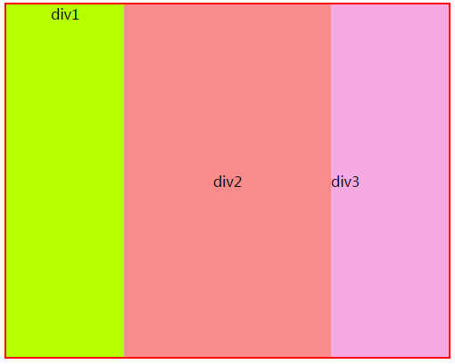

# 前言

本节知识点有：

* box-shadow盒阴影
* box-sizing盒大小
* 多栏布局
* 盒布局

# box-shadow盒阴影

* box-shadow
	* 参数一：正值阴影往右偏，负值往左偏
	* 参数二：正值阴影往下偏，负值往上偏
	* 参数三：阴影的模糊程度，值越大模糊度越高
	* 参数四：实心距离
	* 参数五：阴影颜色

**示例**

    

# box-sizing盒大小

* box-sizing
	* content-box:默认，大小只包含内容区域，总大小等于 内容区+padding+border
	* padding-box:内容包含padding,总大小等于设定的width+border，内容区大小等于总大小-padding
	* border-box: 内容包含border和padding，总大小等于设定的width、height。内容区等于总大小-padding-border

**示例代码**

	<!DOCTYPE html>
	<html>
	<head>
	<meta http-equiv="Content-Type" content="text/html; charset=utf-8"/>
	    <title></title>
		<meta charset="utf-8" />
	    
	</head>
	<body>
	    

	    

	    

	    

	    

	</body>
	</html>

# 多栏布局

* column-width: 每栏目的宽度
* column-gap: 栏目之间的间隔
* column-count : 数字N，分成N列显示
* column-rule:栏目之间的间隔线

**示例代码**

    

# 盒布局

* display:-webkit-box;将元素设置为盒模型
* -webkit-box-orient:设置布局内容的方向
* -webkit-box-flex：设置合布局所占父元素比例权重
* -webkit-box-pack：设置合布局水平居中内容
* -webkit-box-align:设置合布局垂直居中内容

---

	<!DOCTYPE html>
	<html>
	<head>
	    <title></title>
	    
	</head>
	<body>
	    

	        
div1

	        
div2

	        
div3

	    

	</body>
	</html>

