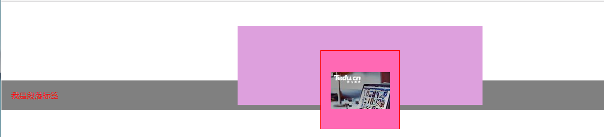
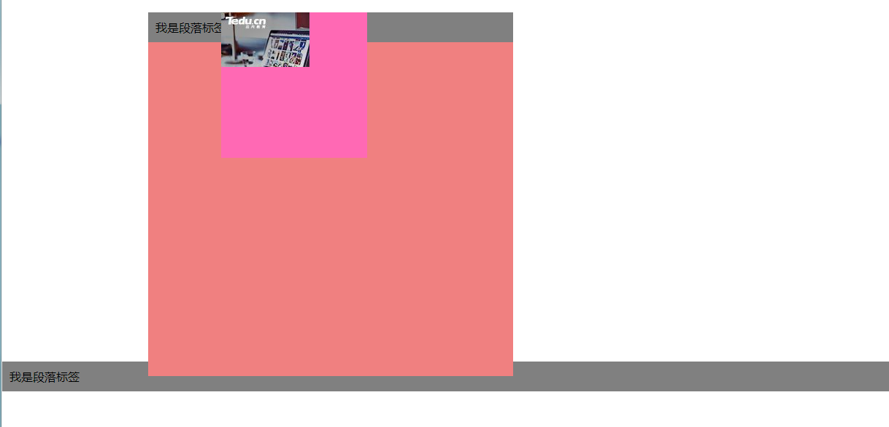
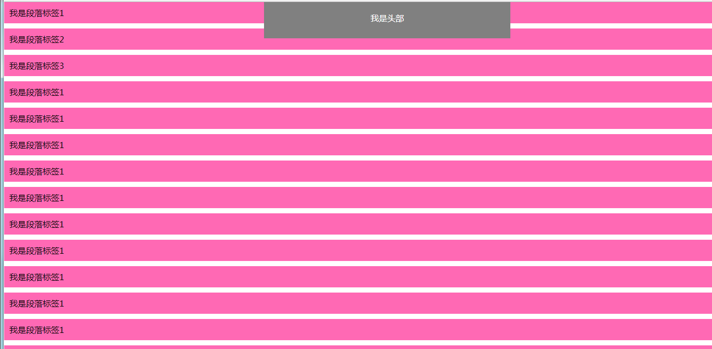

# 前言

这节介绍CSS中的各种布局，在开发网页时候经常会用到布局，它和各种居中同样重要。

* 普通布局
* 相对布局
* 绝对布局
* 固定布局

# 普通布局

> 1. 需要理解块级元素(block)、内联元素(inline)以及内联块状元素（inline-block）之间的区别
> 2. 任何元素浮动(float)之后都会变为内联块状元素
> 3. 普通布局都具有盒模型的特征，它就像一个盒子，拥有外边距、内边距、边框和内容

**示例代码**

	<!DOCTYPE html>
	<html>
	<head>
	    <meta http-equiv="Content-Type" content="text/html; charset=utf-8" />
	    <title></title>
	    <meta charset="utf-8" />
	    
	</head>
	<body>
	    

	        

	            
	        

	        近人——习近平谈作风建设
	        党的理论创新  金砖国家峰会  述评八  砥砺奋进  论坛
	        李克强作出批示  张德江举行会谈  刘云山参观博览会
	        “天鸽”西移风雨持续 抢险救援一刻不停
	        中国向美遣返红通逃犯:广州落网 严重暴力犯罪
	        中国在世界最大风口修桥 海域复杂惊诧七位院士
	        京津冀大气治理方案发布 红警期间污染物须减30%
	        郑州：骑共享单车交通违法 将被禁用或冻结账户
	        网信办：网站不得向未实名认证的用户提供跟帖评论服务
	        第14号台风“帕卡”将于27日在广东到海南沿海登陆
	        向美韩“示威”？俄战略轰炸机飞越朝鲜半岛海域
	        中国籍人士在美被捕?被控为黑客共犯攻击美政府
	        魅族冤不冤？产品被质疑国内国外"双重标准"
	        重庆打掉聋哑人盗窃团伙 五省市领回150万财物
	        三星太子受审路：曾三度密会朴槿惠仍可能被特赦
	        湖北23岁留学生日本失联11日 失联前曾买回国机票
	        清华日晷刻字刚被清除 二校门又被刻"皇上我来了"
	        《福布斯》全球演员收入排行榜 成龙成唯一入榜中国人
	        韩国首位女总理入狱2年后刑满释放 坚称
	        近人——习近平谈作风建设
	        党的理论创新  金砖国家峰会  述评八  砥砺奋进  论坛
	        李克强作出批示  张德江举行会谈  刘云山参观博览会
	        “天鸽”西移风雨持续 抢险救援一刻不停
	        中国向美遣返红通逃犯:广州落网 严重暴力犯罪
	        中国在世界最大风口修桥 海域复杂惊诧七位院士
	        京津冀大气治理方案发布 红警期间污染物须减30%
	        郑州：骑共享单车交通违法 将被禁用或冻结账户
	        网信办：网站不得向未实名认证的用户提供跟帖评论服务
	        第14号台风“帕卡”将于27日在广东到海南沿海登陆
	        向美韩“示威”？俄战略轰炸机飞越朝鲜半岛海域
	        中国籍人士在美被捕?被控为黑客共犯攻击美政府
	        魅族冤不冤？产品被质疑国内国外"双重标准"
	        重庆打掉聋哑人盗窃团伙 五省市领回150万财物
	        三星太子受审路：曾三度密会朴槿惠仍可能被特赦
	        湖北23岁留学生日本失联11日 失联前曾买回国机票
	        清华日晷刻字刚被清除 二校门又被刻"皇上我来了"
	        《福布斯》全球演员收入排行榜 成龙成唯一入榜中国人
	        韩国首位女总理入狱2年后刑满释放 坚称
	    

	</body>
	</html>

# 相对布局

> 1. 不管父元素是不是设置了相对布局，它总是针对父元素来确定自己位置
> 2. 相对布局后它会脱离文档流，但是它依然占有它原来的位置
> 3. 相对布局之后，如果有margin-left，那么margin-left会优先于left
> 4. 相对布局之后，如果有margin:auto，那么margin:auto会优先于left、right等

**效果图**

**示例代码**

	<!DOCTYPE html>
	<html>
	<head>
	    <meta http-equiv="Content-Type" content="text/html; charset=utf-8" />
	    <title></title>
	    <meta charset="utf-8" />
	    
	</head>
	<body>
	    

	        

	            
	        

	    

	    
我是段落标签

	</body>
	</html>

# 绝对布局

> 1. 父元素设置了相对(绝对)布局，那么它是针对父元素来确定自己位置，否则将针对body来确定
> 2. 绝对布局后它会完全脱离文档流，原来的位置也不会被保留
> 3. 绝对布局之后，如果有margin-left，那么margin-left会优先于left
> 4. 绝对布局之后，如果有margin:auto，那么margin:auto无效，它仍然会使用left来确定位置
> 5. 绝对布局之后，任何元素都会变为内联块状元素

**效果图**

**示例代码**

	<!DOCTYPE html>
	<html>
	<head>
	    <meta http-equiv="Content-Type" content="text/html; charset=utf-8" />
	    <title></title>
	    <meta charset="utf-8" />
	    
	</head>
	<body>
	    

	        

	            
	        

	        
我是段落标签

	    

	    
我是段落标签

	</body>
	</html>

# 固定布局

> 1. 固定布局总是针对body来确定位置的
> 2. 固定布局后它会完全脱离文档流，原来的位置也不会被保留
> 3. 固定布局之后，如果有margin-left，那么margin-left会优先于left
> 4. 固定布局之后，如果有margin:auto，那么margin:auto无效，它仍然会使用left来确定位置
> 5. 固定布局之后，任何元素都会变为内联块状元素

**效果图**

**示例代码**

	<!DOCTYPE html>
	<html>
	<head>
	    <meta http-equiv="Content-Type" content="text/html; charset=utf-8" />
	    <title></title>
	    <meta charset="utf-8" />
	    
	</head>
	<body>
	    

	       我是头部
	    

	    
我是段落标签1

	    
我是段落标签2

	    
我是段落标签3

	    
我是段落标签1

	    
我是段落标签1

	    
我是段落标签1

	    
我是段落标签1

	    
我是段落标签1

	    
我是段落标签1

	    
我是段落标签1

	    
我是段落标签1

	    
我是段落标签1

	    
我是段落标签1

	    
我是段落标签1

	</body>
	</html>

