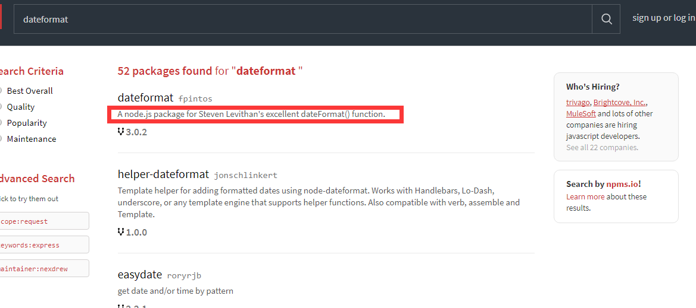

# 介绍

先前已经介绍过[JavaScript模块化开发](../03/README.md)，同时总结了AMD和CMD的区别。

但是先前的模块化开发它们之间的关联使用的是require.js或者sea.js,它们的入口文件都需要一个html页面。

nodejs服务器端开发是可以不需要html页面的，本节将介绍nodejs的模块化，通过学习完本节后，以前使用到NPM安装的一些插件你会知其然也知其所以然了。

本节内容：

1. 回顾AMD模块化之require
2. 回顾CMD模块化之sea
3. 回顾CommonJS模块化之node
3. node模块化之简单使用
4. node模块化之node_modules
5. node模块化之npm
6. 使用第三方插件完成日期格式化

# 回顾AMD模块化之require

AMD推崇依赖前置，就是提前加载依赖项

定义模块：

	define(模块ID？，依赖列表数组?,回调函数(){
		//使用return对外暴露变量或函数
		return {
			
		}
	});

加载依赖：

	require([依赖的模块列表],回调函数(){
		//当依赖项全部加载完成后会执行回调函数。
	});

# 回顾CMD模块化之sea

CMD推崇就近依赖，就是何时用何时依赖

定义模块：

	define(回调函数(require,exports,module){
		//暴露接口使用exports或module.exports
		//什么时候依赖，什么时候就使用reuqire加载
	});

# 回顾CommonJS模块化之node

一个js文件就是一个模块，

暴露变量或函数使用exports

暴露对象构造函数使用module.exports，外部可以使用new来创建对象

# node模块化之简单使用

calc.js

	/*计算模块*/
	exports.add = function (n1, n2) {
	    return n1 + n2;
	}

Person.js

	function Person(name,age) {
	    this.name = name;
	    this.age = age;
	}
	Person.prototype.say = function () {
	    return "我是：" + this.name + ",年龄:" + this.age;
	}
	
	module.exports = Person;

app.js:

	'use strict';

	var calc = require("./calc.js");
	var Person = require("./Person.js");
	console.log(calc.add(10,5));
	
	console.log(new Person("zhang",20).say());

# node模块化之node_modules

从上面的代码来看，reuqire加载依赖需要指定路径和文件，我们想要像第一章那样引用http模块的方式来引用自己的模块怎么办呢？？

app.js

	'use strict';
	var calc = require("calc");
	var Person = require("Person");
	console.log(calc.add(10,5));
	console.log(new Person("zhang",20).say());

这时候，其实是默认引用了node_modules/calc/index.js，当然我们也可以配置package.json来指定入口文件。笔记不好做，直接贴代码了。

node_modules/calc/calc.js:

	/*!
	 *  学习使用的calc计算模块。
	 */
	
	(function () {
	    var calc = {};
	    calc.add = function (n1, n2) {
	        return n1 + n2;
	    }
	
	    //Nodejs
	    if (typeof module != "undefined" && module.exports) {
	        module.exports = calc;
	    }
	    //AMD / RequireJS
	    else if (typeof define !== 'undefined' && define.amd) {
	        define([], function () {
	            return async;
	        });
	    }
	})();

node_modules/calc/package.json:

	{
	  "name": "calc",
	  "version": "1.0.0",
	  "description": "learn use calc module",
	  "main": "calc.js",
	  "scripts": {
	    "test": "echo \"Error: no test specified\" && exit 1"
	  },
	  "keywords": [
	    "calc",
	    "learn"
	  ],
	  "author": "HUC",
	  "license": "ISC"
	}

node_modules/person/Person.js:

	/*!
	 *  学习使用的Person模块。
	 */
	(function () {
	    function Person(name, age) {
	        this.name = name;
	        this.age = age;
	    }
	    Person.prototype.say = function () {
	        return "我是：" + this.name + ",年龄:" + this.age;
	    }
	    //Nodejs
	    if (typeof module != "undefined" && module.exports) {
	        module.exports = Person;
	    }
	    //AMD / RequireJS
	    else if (typeof define !== 'undefined' && define.amd) {
	        define([], function () {
	            return Person;
	        });
	    }
	})();

node_modules/person/package.json:

	{
	  "name": "Person",
	  "version": "1.0.0",
	  "description": "learn use Person module",
	  "main": "Person.js",
	  "scripts": {
	    "test": "echo \"Error: no test specified\" && exit 1"
	  },
	  "keywords": [
	    "Person",
	    "learn"
	  ],
	  "author": "HUC",
	  "license": "ISC"
	}

**总之记住几点：**

1. 依赖路径不加点杠，默认引用node_modules文件夹下的文件
2. 依赖路径不加点杠并且没有指定后缀js文件，会引用node_modules下的某个文件夹中的index.js
3. 模块可以配置package.json来指定入口和依赖项，

package.json中的参数会放到最后小节介绍。

# node模块化之npm

npm官网：[www.npmjs.com](www.npmjs.com)

安装了node之后npm会自动安装好，由于国内环境，建议单独安装cnpm，
[可以参考FIS3中cnpm的搭建](../04/02.md)。

**创建一个package.json文件**

	npm init

**查看插件可用版本**

	npm view 插件名 versions --json

**通过npm安装一些插件，并将插件信息保存到package.json**

	npm install 插件名 --save -d

**已有package.json配置后，执行此命令将会自动下载配置中的所有插件**
	
	npm install

**卸载插件**

	npm uninstall 插件名

**全局安装插件**

	npm install 插件名 -g

**全局卸载插件**

	npm uninstall 插件名 -g

**全局安装完成后，对应windows系统中的目录**

	C:\Users\Administrator\AppData\Roaming\npm

**package.json参数解释**

参考：[http://javascript.ruanyifeng.com/nodejs/packagejson.html#toc2](http://javascript.ruanyifeng.com/nodejs/packagejson.html#toc2)
	
	{
	  //模块名称
	  "name": "Hello World",
	  //版本
	  "version": "0.0.1",
	  //作者
	  "author": "张三",
	  //描叙
	  "description": "第一个node.js程序",
	  //关键字
	  "keywords": [ "node.js", "javascript" ],
	  //源码仓库
	  "repository": {
	    "type": "git",
	    "url": "https://path/to/url"
	  },
	  //版权许可证
	  "license": "MIT",
	  //模块运行的平台
	  "engines": { "node": "0.10.x" },
	  //贡献者，投资者
	  "contributors": [
	    {
	      "name": "李四",
	      "email": "lisi@example.com"
	    }
	  ],
	  //指定了运行脚本命令的npm命令行缩写，下面的设置指定了npm run start所要执行的命令。
	  "scripts": {
	    "start": "node index.js"
	  },
	  //项目运行所依赖的模块
	  "dependencies": {
	    "express": "latest",
	    "mongoose": "~3.8.3",
	    "handlebars-runtime": "~1.0.12",
	    "express3-handlebars": "~0.5.0",
	    "MD5": "~1.2.0"
	  },
	  //项目开发时所依赖的模块
	  "devDependencies": {
	    "bower": "~1.2.8",
	    "grunt": "~0.4.1",
	    "grunt-contrib-concat": "~0.3.0",
	    "grunt-contrib-jshint": "~0.7.2",
	    "grunt-contrib-uglify": "~0.2.7",
	    "grunt-contrib-clean": "~0.5.0",
	    "browserify": "2.36.1",
	    "grunt-browserify": "~1.3.0"
	  }
	}

# 使用第三方插件完成日期格式化

> npm社区提供了几十万个插件，几乎你想得到的功能都有人提供了相应的插件，不需要我们重复造轮子就能完成快速开发

经过上面一系列的小节，对于npm和package.json也有所了解了。接下来我们将使用npm社区提供的插件完成日期格式化的操作。

需求：执行日期格式化操作

**上[npm社区](www.npmjs.com)搜索dateformat插件**

**进入[dateformat插件](https://www.npmjs.com/package/dateformat)明细页，可以看到列出了使用的API**

**因为国内网络原因，使用cnpm来安装插件**

	cnpm install dateformat --save -d

安装完成后目录中会多出来node_modules和package.json，这里就不解释了，如果不懂请先学习上面的小节知识。

**创建我们的执行文件，test.js**

	var dateFormat = require("dateformat");
	console.log(dateFormat(new Date(), "yyyyMMddHHmmss"));

**执行test.js**

	node test.js

自始至终我们仅仅只使用了两行代码。就完成了日期格式化的列子，你也可以通过所学到的只是进入node_modules中找到dateformat.js的源码进行查看。

并学习自己如何编写类似的插件。
