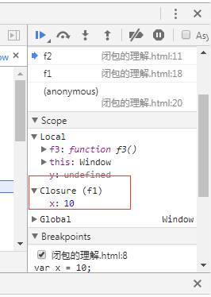
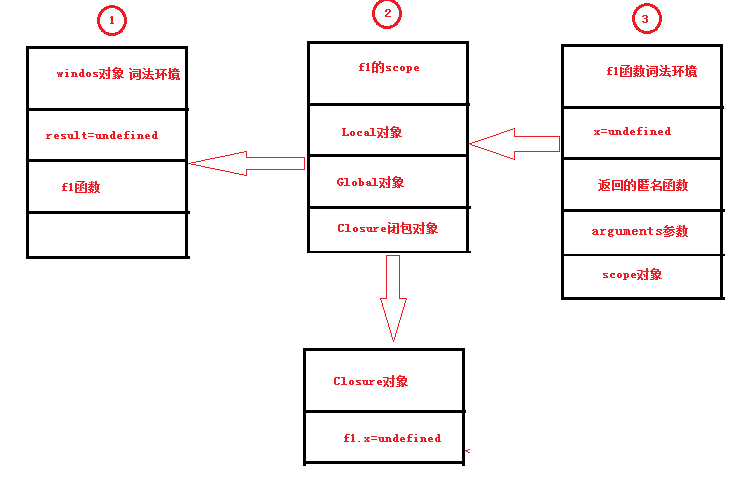
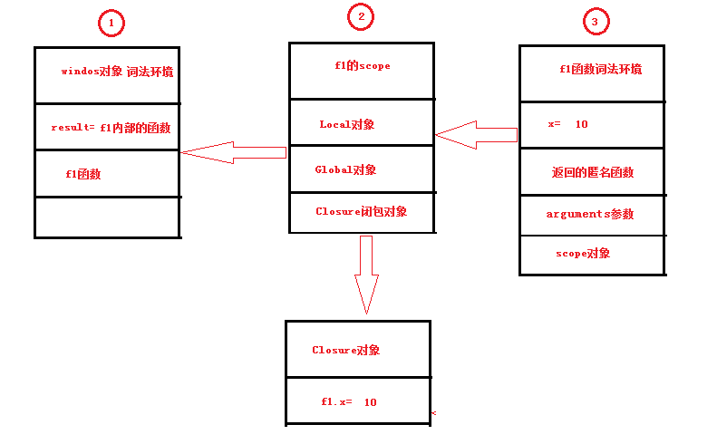
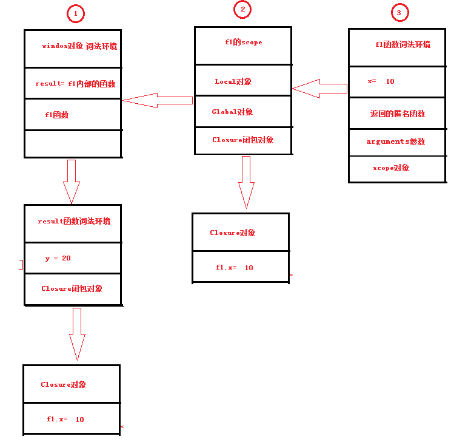
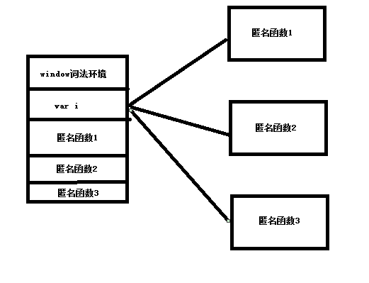
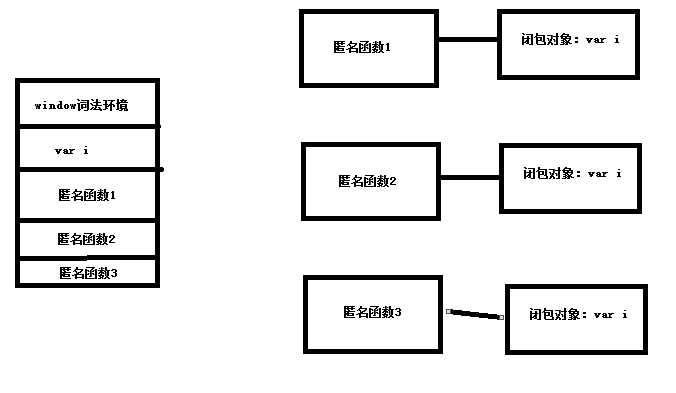

# 前言

这节将讨论：

1. 闭包的概念
2. 闭包的理解
3. 闭包的好处
4. 闭包的注意点

# 闭包的概念

闭包是指有权限访问另一个函数作用域链的成员都是闭包

# 闭包的理解

闭包的特点：

1. 一个函数在另外一个函数里面就才会产生闭包
2. 如果里面的函数没有用到父函数的成员不会产生闭包
3. 预处理阶段就开始扫描函数内部代码，这是就会产生闭包。闭包函数在调用之前就已经产生了闭包
4. 每次调用函数都会产生一个新的闭包

## 通过调试工具查看闭包

代码：

    

通过谷歌浏览器的调试工具，在代码注释的地方加上断点运行，观察

可以看出，当程序走到 **第二个**断点位置，闭包就已经产生了，这印证了闭包在父函数预处理阶段就已经产生了。

## 图解闭包原理

为了少画点图，我们通过另外的闭包代码来解释。

代码：

    

第一步：js引擎解析js代码，首先进行全局预处理。

第二步： 调用f1函数，会进行函数预处理,扫描之后发现匿名函数中使用了它父函数的成员，因此闭包对象产生。

第三步： 执行f1函数，此时哪些undefined将会被替换为正常的值。

第四步：执行result函数，匿名函数返回出去之后就销毁了，这时候result函数逻辑和匿名函数一样

总结：

通过上图的理解，可以发现，只要闭包产生都会带一个拖油瓶一样的闭包对象。这个对象跟随的是函数作用域链，所以印证了**每次调用函数都会产生一个新的闭包**

## 小节

根据闭包的原理及理解，来看如下代码的输出结果：

    

输出结果是：

11

12

11

12

# 闭包的好处

1. 减少了全局变量的定义，不污染全局空间

2. 减少了参数的传递，增强了代码的封装性

需求一：

> 体现了闭包的好处之一：减少了全局变量的定义，不污染全局空间

计数器功能，调用一次函数，变量就累加一次。

传统方式：

    

闭包方式：

    

需求二：

> 体现了闭包的好处之一：减少了参数的传递，增强了代码的封装性

计算工厂，两个参数，参数一是需要循环累加的值，参数二是累加完结果后在加上的值

传统方式：每次调用都要传递二个参数，封装性也不好。

    

闭包方式：可以创建一个计算工厂

    

# 闭包的注意事项

1. 每次调用父函数，将会产生一个新的闭包。
2. 闭包在循环中的问题

第一点就不用多讲了，真正理解了图解闭包的原理，这将不需要做过多的解释。

关键在第二个注意事项中。看如下代码：
	
	<!DOCTYPE html>
	<html>
	<head>
	    <title></title>
	
	</head>
	<body>
	    <input type="button" value="第一个按钮" class="btn" />
	    <input type="button" value="第二个按钮" class="btn" />
	    <input type="button" value="第三个按钮" class="btn" />
	    
	</body>
	</html>

每次点击按钮都是弹出：第3个按钮。

根据我们学习到的知识进行理解，应该是**i**属于全局window的词法环境，循环之后会出现三个匿名函数，它们使用的都是全局的变量**i**。

代码应该利用闭包将变量**i**像拖油瓶一样代入到三个匿名函数的闭包对象中。

利用闭包解决：

改写代码第一步：
> 先不管其他的，闭包肯定是要一个函数存在另外一个函数内才能产生，所以第一步是这样

    

改写代码第二步：

> 闭包对象第二个条件是，只有当子函数访问了父函数的成员才会产生闭包，所以我们需要在父函数定义一个变量或者代入一个参数供子函数访问。

    

改写代码第三步：

> 经过第二步还不行，当按钮点击之后它只会执行父函数，父函数在返回一个子函数，自始至终子函数还是没有被调用执行。
> 
> 我们希望的是，循环期间就自动执行父函数，将返回值绑定到按钮点击事件中，这样按钮一点击就会执行子函数了，这里就需要使用到函数自调用的知识了。

	<!DOCTYPE html>
	<html>
	<head>
	    <title></title>
	
	</head>
	<body>
	    <input type="button" value="第一个按钮" class="btn" />
	    <input type="button" value="第二个按钮" class="btn" />
	    <input type="button" value="第三个按钮" class="btn" />
	    
	</body>
	</html>

# 总结

* 闭包的产生条件有两点：一、必须是父子函数，二、子函数必须使用了父函数的成员
* 闭包的产生时机：在函数预处理阶段就产生了闭包
* 学会使用谷歌浏览器查看闭包，可以通过三层函数来查看闭包产生时机。
* 通过图解理解闭包在内存中的表现形式。
* 学会使用闭包和自调用函数来解决循环的一些问题。

