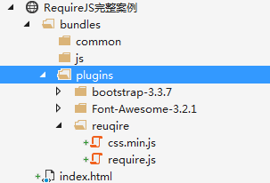

# 简介

主要学习如何使用RequireJS来解决模块化JS编程，知识点有:

1. RequireJS介绍
2. 配置模块和依赖
3. 编写自定义模块
4. 完整的案例

# RequireJS介绍

RequireJS是AMD规范的模块化编程方式，使用它最主要的好处是，**它帮我们管理了模块之间的依赖关系，我们不需要在页面中引入JS文件，还要特别小心的注意js文件之间的顺序，假设有个依赖于jquery的插件bootstart.js，它被引用在了jquery之前，这样页面就出错了**

RequireJS的官网：[http://requirejs.org/](http://requirejs.org/)

通过访问官网下载我们所需要的require.js.下载完成之后，将即刻进入下一小节的学习

# 配置模块和依赖

新建一个项目，目录结构如下：

index.html:

	<!DOCTYPE html>
	<html>
	<head>
	    <meta http-equiv="Content-Type" content="text/html; charset=utf-8" />
	    <title></title>
	    <meta charset="utf-8" />
	</head>
	<body>
	    
	</body>
	</html>

准备工作就做完了，接下来我们需要配置require，这是需要一个入口文件。当然，你可以使用如下方式，

	

这种是异步加载的方式，后期会出现一些问题，所以最后还是用另一种方式来引用入口配置文件：

    
    

入口文件引用了之后，接下来就是编写入口的配置了。

## 配置参数

入口配置只需要编写一次就行了，初始语法如下：

	requirejs.config({
	
	});

可以看出这就是一个json对象，我们主要就是写对象里面的属性来进行模块的配置。页面需要引入jquery插件，那么我们就需要在入口文件中配置一个jquery的模块。

	requirejs.config({
	    paths: {
	        "jquery": ["https://cdn.bootcss.com/jquery/3.2.1/jquery.min"]
	    }
	});

当然，它还有很多的参数，如：baseUrl、shim等等,这些等到完整的案例中在介绍

## 使用模块

当我们经过上面的小节配置了jquery的模块后，我们需要使用它。

引入模块的语法：

        require([], function () {
        });

第一个参数是数组，表示需要依赖的模块有哪些。

第二个参数是函数，当依赖的模块全部加载完成后执行。

我们需要使用jquery的语法将整个body背景颜色变为红色，那么

index.html：

	<!DOCTYPE html>
	<html>
	<head>
	    <meta http-equiv="Content-Type" content="text/html; charset=utf-8" />
	    <title></title>
	    <meta charset="utf-8" />
	</head>
	<body>
	    
	    
	    
	</body>
	</html>

**function里面的参数名称随便写**

或许你现在还是看不出使用require的好处，没关系。坚持下去总会明白

# 编写自定义模块

前面的小节学会了如何配置jquery模块，并且怎么使用它。那么这次我们自己编写一个模块并使用。

自定义模块的语法：

	define([], function () {
	
	});

同样是两个参数，参数意义和你想的一样。

现在来创建自己的模块，就把它叫做my.js吧！命名烦恼

	define(["jquery"], function ($) {
	    return {
	        changeBodyColor: function () {
	            $("body").css({ "background-color": "red" });
	        }
	    }
	});

一个js文件就是一个模块，这个模块依赖于jquery，模块返回了一个对象。对象中有一个改变body颜色的function，就这么简单。

**自定义模块写好之后，还需要把它加入到入口配置文件中，其实就是把模块交给require管理，让它能够认识这个模块**

	requirejs.config({
	    baseUrl:"js",
	    paths: {
	        "jquery": ["https://cdn.bootcss.com/jquery/3.2.1/jquery.min"],
	        "mymodel":"my"
	    }
	});

接下来页面中使用它

	<!DOCTYPE html>
	<html>
	<head>
	    <meta http-equiv="Content-Type" content="text/html; charset=utf-8" />
	    <title></title>
	    <meta charset="utf-8" />
	</head>
	<body>
	    
	    
	    
	</body>
	</html>

看下图：

分析：

1. 首先用户请求地址，服务器响应相应的页面index.html
2. 浏览器逐行解析页面时，碰到require.js的引用，那么又向服务器发出请求
3. 再次碰到require.config.js文件，又向服务器请求，这时候入口配置加载进来了
4. 当解析到使用require请求mymodel模块的时候，就可以识别这个模块了，它依赖于jquery模块，所以后面这些依赖会异步请求加载。在复杂的依赖有requirejs帮我们管理异步加载，当这些模块加载完成之后执行回调函数。**这就是AMD的提前加载**

也许看到这，你还是懵懵懂懂。那么继续下去，完整的案例，你会完全明白使用reuqire来帮我们在开发中管理js之间的依赖关系是有多舒服。

# 完整的案例

项目中需要使用到的第三方组件：

[jquery](https://jquery.com/)、[bootstarp](http://www.bootcss.com/)、[font-awesome](http://www.bootcss.com/p/font-awesome/)、[require](http://requirejs.org/)、[css依赖插件](http://www.cnblogs.com/eyu/p/requirejs_require_css.html)

> 真实的大型项目，这些组件都不够，可能还需要使用富文本、树形、日期等等插件，这时候页面中需要写入大量的js和css引用，稍微不注意，js引用顺序出错，那么程序就无法跑起来。require就是为了解决这些问题而生

这些插件可以到官网自行下载，下载完成后创建一个项目，目录结构和介绍如下：

目录介绍：

* bundles文件夹存放项目中的资源，如：字体、图片、样式、脚本等
	* common文件夹存放项目中共用的组件，如：require的入口配置文件、正则验证、加密解密等自定义的共用组件
	* js文件夹存放项目页面的脚本文件
	* plugins文件夹存放第三方的插件，如：bootstarp、require等等

**目录结构根据需求自己设定就行，关键是要目录结构清晰**

项目中需要用到的插件目录结构整理完成后，需要在页面中引入requirejs，并且编写入口配置文件。

index.html:

	<!DOCTYPE html>
	<html>
	<head>
	    <meta http-equiv="Content-Type" content="text/html; charset=utf-8" />
	    <title></title>
	    <meta charset="utf-8" />
	</head>
	<body>
	    
	    
	</body>
	</html>

require.config.js:

	requirejs.config({
	    baseUrl: "bundles/js",
	    paths: {
	        //使用第三方cdn上的jquery可以优化响应速度
	        "jquery": ["https://cdn.bootcss.com/jquery/3.2.1/jquery.min"],
	        //配置bootstarp模块，地址以baseUrl为基准，所以这里需要../返回上一层
	        "bootstarp": "../plugins/bootstrap-3.3.7/js/bootstrap.min",
	        //css模块用于配置依赖css样式表的
	        "css": "../plugins/reuqire/css.min"
	    },
	    shim:{
	        "bootstarp": {
	            //bootstarp模块需要依赖jquery、bootstarp.css，
	            //基本上项目中每个页面需要用到bootstarp和font-awesome图标，所以font-awesome也配置成bootstarp的依赖项了
	            "deps": ["jquery", "css!../plugins/bootstrap-3.3.7/css/bootstrap.min.css", "css!../plugins/Font-Awesome-3.2.1/css/font-awesome.min.css"]
	        }
	    }
	});
	
	//入口配置加载完后马上引用bootstarp模块
	//反正每个页面都要使用jquery、bootstarp、font - awesome
	
	require(["bootstarp"]);

这时候浏览页面，请求如图：

> 当引用bootstarp模块的时候，它会根据shim中配置的依赖关系顺序加载
> 
>jquery、css.min.js、bootstarp.min.css、font-awesome.min.css
>
>依赖项全部加载完成后才加载bootstarp.min.js

接下来我们就可以在页面中使用bootstarp插件了，我们写一个按钮，点击按钮后弹出登录框。

	<!DOCTYPE html>
	<html>
	<head>
	    <meta http-equiv="Content-Type" content="text/html; charset=utf-8" />
	    <title></title>
	    <meta charset="utf-8" />
	</head>
	<body>
	     
	     
	    <!-- Button trigger modal -->
	    <button id="btn-modal">弹出登录框</button>
	    <!-- Modal -->
	    

	        

	            

	                

	                    <button type="button" class="close" data-dismiss="modal">&times;</button>
	                    <i class="icon-spinner icon-spin"></i>登录
	                

	                

	                    

	                        @
	                        <input type="text" class="form-control" placeholder="请输入用户名" id="username">
	                    

	                    

	                        @
	                        <input type="password" class="form-control" placeholder="请输入密码" id="password">
	                    

	                

	                

	                    <button type="button" class="btn btn-default" data-dismiss="modal">关闭</button>
	                    <button type="button" id="btn-login" class="btn btn-primary">登录</button>
	                

	            

	        

	    

	    
	    
	</body>
	</html>

这时候刷新快一点会发现对话框有闪屏问题，原因嘛不用说也知道。这种解决方式最好就是在头部引用相关的css。这里为了介绍配置中可以依赖css所以特意留下这个缺陷

index.html

	<!DOCTYPE html>
	<html>
	<head>
	    <meta http-equiv="Content-Type" content="text/html; charset=utf-8" />
	    <title></title>
	    <meta charset="utf-8" />
	    <link href="bundles/plugins/bootstrap-3.3.7/css/bootstrap.min.css" rel="stylesheet" />
	    <link href="bundles/plugins/Font-Awesome-3.2.1/css/font-awesome.min.css" rel="stylesheet" />
	</head>
	<body>
	     
	     
	    <!-- Button trigger modal -->
	    <button id="btn-modal">弹出登录框</button>
	    <!-- Modal -->
	    

	        

	            

	                

	                    <button type="button" class="close" data-dismiss="modal">&times;</button>
	                    <i class="icon-spinner icon-spin"></i>登录
	                

	                

	                    

	                        @
	                        <input type="text" class="form-control" placeholder="请输入用户名" id="username">
	                    

	                    

	                        @
	                        <input type="password" class="form-control" placeholder="请输入密码" id="password">
	                    

	                

	                

	                    <button type="button" class="btn btn-default" data-dismiss="modal">关闭</button>
	                    <button type="button" id="btn-login" class="btn btn-primary">登录</button>
	                

	            

	        

	    

	    
	    
	</body>
	</html>

接下来，编写页面独有的js文件。

js/index.js

	define(["jquery", "ntv"], function ($,ntv) {
	    $("#btn-modal").click(function () {
	        $('#myModal').modal({});
	    });
	    $("#btn-login").click(function () {
	        if (!ntv.username($("#username").val())) {
	            alert("用户名验证错误");
	        }
	    });
	});

ntv是我们自定义的共用的正则验证模块

common/neatness.validate.js

	define([], function () {
	    return {
	        username: function (value) {
	            //匹配用户名,可以并只能包含数字字母下划线点或者@符号,必须以数字或者字母开头,长度大于6个字符并且不能超过30个字符
	            return /^[\w\d][\w\d\.\@]{5,29}$/.test(value);
	        },
	        password: function (value) {
	            return /^\S{6,20}$/.test(value);
	        }
	    }
	});

后面这两个模块我们还需要将它加入require容器，确保reuqire能识别

common/require.config.js:

	requirejs.config({
	    baseUrl: "bundles/js",
	    paths: {
	        //使用第三方cdn上的jquery可以优化响应速度
	        "jquery": ["https://cdn.bootcss.com/jquery/3.2.1/jquery.min"],
	        //配置bootstarp模块，地址以baseUrl为基准，所以这里需要../返回上一层
	        "bootstarp": "../plugins/bootstrap-3.3.7/js/bootstrap.min",
	        //css模块用于配置依赖css样式表的
	        "css": "../plugins/reuqire/css.min",
	        //共用的正则验证模块
	        "ntv": "../common/neatness.validate",
	        //页面模块,baseUrl为基准目录，所以这里不用做目录的处理了
	        "index":"index"
	    },
	    shim:{
	        "bootstarp": {
	            //bootstarp模块需要依赖jquery、bootstarp.css，
	            //基本上项目中每个页面需要用到bootstarp和font-awesome图标，所以font-awesome也配置成bootstarp的依赖项了
	            "deps": ["jquery", "css!../plugins/bootstrap-3.3.7/css/bootstrap.min.css", "css!../plugins/Font-Awesome-3.2.1/css/font-awesome.min.css"]
	        }
	    }
	});
	
	//入口配置加载完后马上引用bootstarp模块
	//反正每个页面都要使用jquery、bootstarp、font - awesome
	
	require(["bootstarp"]);

页面引入index模块：

	<!DOCTYPE html>
	<html>
	<head>
	    <meta http-equiv="Content-Type" content="text/html; charset=utf-8" />
	    <title></title>
	    <meta charset="utf-8" />
	    <link href="bundles/plugins/bootstrap-3.3.7/css/bootstrap.min.css" rel="stylesheet" />
	    <link href="bundles/plugins/Font-Awesome-3.2.1/css/font-awesome.min.css" rel="stylesheet" />
	</head>
	<body>
	     
	     
	    <!-- Button trigger modal -->
	    <button id="btn-modal">弹出登录框</button>
	    <!-- Modal -->
	    

	        

	            

	                

	                    <button type="button" class="close" data-dismiss="modal">&times;</button>
	                    <i class="icon-spinner icon-spin"></i>登录
	                

	                

	                    

	                        @
	                        <input type="text" class="form-control" placeholder="请输入用户名" id="username">
	                    

	                    

	                        @
	                        <input type="password" class="form-control" placeholder="请输入密码" id="password">
	                    

	                

	                

	                    <button type="button" class="btn btn-default" data-dismiss="modal">关闭</button>
	                    <button type="button" id="btn-login" class="btn btn-primary">登录</button>
	                

	            

	        

	    

	    
	    
	    
	</body>
	</html>

这样页面简洁了很多，所有的依赖关系都交给reuqire处理，而且AMD的写法保证了不污染全局环境，每个js文件都是相对独立的，避免了命名冲突。

# 总结

1. 学会配置reuqire的入口文件，和依赖关系
2. 学会如何引用模块
3. 学会如何编写自己的模块
4. [开发中常用插件集配置参考](http://blog.csdn.net/warrah/article/details/53053939)