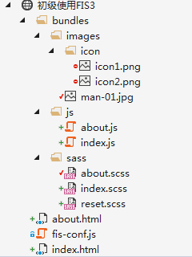
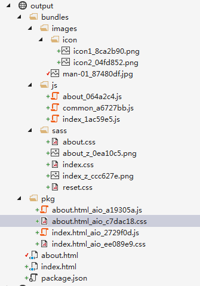

经过了前两节的预热，此时对fis3也有了一定的了解，接下来就一步一步往复杂了说。最后一章将会给出完整的解决方案

# 相关插件

首先，在开始之前新建一个目录作为项目的根目录，然后执行初始化一个package.json文件。

	npm init

接着，使用语法在当前目录安装需要使用的插件：

	npm install 插件名称 --save -d

这里，提供一份本节需要使用到的插件的package.json

	{
	  "name": "huc",
	  "version": "1.0.0",
	  "description": "",
	  "main": "index.js",
	  "scripts": {
	    "test": "echo \"Error: no test specified\" && exit 1"
	  },
	  "author": "",
	  "license": "ISC",
	  "dependencies": {
	    "fis-parser-less": "^0.1.3",
	    "fis-parser-node-sass": "^1.0.1",
	    "fis3-postpackager-loader": "^2.1.4"
	  }
	}

# 开启旅程

构建项目结构。如图：

index.html:

	<!DOCTYPE html>
	<html>
	<head>
	    <meta http-equiv="Content-Type" content="text/html; charset=utf-8" />
	    <title></title>
	    <meta charset="utf-8" />
	    <link href="bundles/sass/reset.scss" rel="stylesheet" />
	    <link href="bundles/sass/index.scss" rel="stylesheet" />
	</head>
	<body>
	    
首页><a href="about.html">关于</a>

	    <input type="button" id="btn" value="首页按钮" />
	    

    	
	    
	</body>
	</html>

其他的也都差不多，可以查看相应的demo源码。

fis-conf.js:

	fis.match('::package', {
	
	    //启用 fis-spriter-csssprites 插件,已内置
	    spriter: fis.plugin('csssprites'),
	
	    //启用 fis3-postpackager-loader 插件
	    postpackager: fis.plugin('loader', {
	        allInOne: true
	    })
	});
	
	//文件携带 md5 戳
	fis.match("*.{png,jpg,css,js}", {
	    useHash: true
	});
	
	//编译scss
	fis.match('*.{sass,scss}', {
	    rExt: '.css',
	    parser: fis.plugin('node-sass')
	});
	
	//编译less
	fis.match('*.less', {
	    rExt: '.css',
	    parser: fis.plugin('less')
	});
	
	fis.match('*.{css,less,sass,scss}', {
	    // 雪碧图打包
	    useSprite: true
	});
	
	fis.match('*.{css,sass,scss,less}', {
	    // fis-optimizer-clean-css 插件进行压缩，已内置
	    optimizer: fis.plugin('clean-css')
	});
	
	fis.match("*.js", {
	    // fis-optimizer-uglify-js 插件进行压缩，已内置
	    optimizer: fis.plugin("uglify-js")
	});
	
	fis.match('*.png', {
	    // fis-optimizer-png-compressor 插件进行压缩，已内置
	    optimizer: fis.plugin('png-compressor')
	});

发布：

	fis3 release -d ./output

发布后的结构如图：

这种方式始终还是不够理想，如：

* js等文件合并后是在PKG文件夹，并且和bundles同级，这就不好了。
* 页面中有jquery等插件，还有其他一些插件，都被打包到一个文件了。

