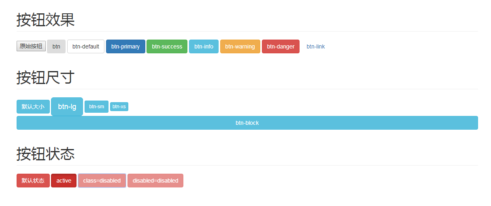

# 介绍

**按钮效果**

* ``btn``:
* ``btn-default``:
* ``btn-primary``:
* ``btn-success``:
* ``btn-info``:
* ``btn-warning``:
* ``btn-danger``:
* ``btn-link``:按钮变为超链接效果

**按钮尺寸**

* ``btn-lg``:大按钮
* ``btn-sm``:小按钮
* ``btn-xs``:超小按钮
* ``btn-block``:将按钮变为块级元素

**激活状态**

* ``active``:激活状态
* ``disabled``:禁用状态

**效果图**

**示例代码**

	<!DOCTYPE html>
	<html>
	<head>
	    <meta name="viewport" content="width=device-width, initial-scale=1, maximum-scale=1, user-scalable=no">
	    <meta http-equiv="Content-Type" content="text/html; charset=utf-8" />
	    <title></title>
	    <meta charset="utf-8" />
	    <link href="https://cdn.bootcss.com/bootstrap/3.3.7/css/bootstrap.css" rel="stylesheet">
	</head>
	<body>
	    

	        <h1 class="page-header">按钮效果</h1>
	        <button>原始按钮</button>
	        <button class="btn">btn</button>
	        <button class="btn btn-default">btn-default</button>
	        <button class="btn btn-primary">btn-primary</button>
	        <button class="btn btn-success">btn-success</button>
	        <button class="btn btn-info">btn-info</button>
	        <button class="btn btn-warning">btn-warning</button>
	        <button class="btn btn-danger">btn-danger</button>
	        <button class="btn btn-link">btn-link</button>
	        <h1 class="page-header">按钮尺寸</h1>
	        <button class="btn btn-info">默认大小</button>
	        <button class="btn btn-info btn-lg">btn-lg</button>
	        <button class="btn btn-info btn-sm">btn-sm</button>
	        <button class="btn btn-info btn-xs">btn-xs</button>
	        <button class="btn btn-info btn-block">btn-block</button>
	        <h1 class="page-header">按钮状态</h1>
	        <button class="btn btn-danger">默认状态</button>
	        <button class="btn btn-danger active">active</button>
	        <button class="btn btn-danger disabled">class=disabled</button>
	        <button class="btn btn-danger" disabled="disabled">disabled=disabled</button>
	    

	</body>
	</html>
