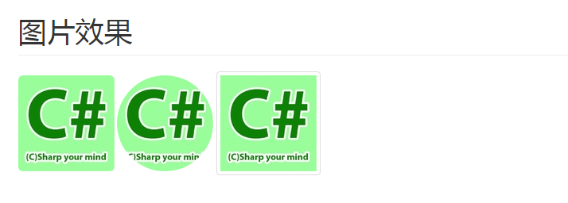

# 介绍

**图片效果**

* ``img-rounded``:圆角
* ``img-circle``:圆形
* ``img-thumbnail``:轮廓

**效果图**

**示例代码**

	<!DOCTYPE html>
	<html>
	<head>
	    <meta name="viewport" content="width=device-width, initial-scale=1, maximum-scale=1, user-scalable=no">
	    <meta http-equiv="Content-Type" content="text/html; charset=utf-8" />
	    <title></title>
	    <meta charset="utf-8" />
	    <link href="https://cdn.bootcss.com/bootstrap/3.3.7/css/bootstrap.css" rel="stylesheet">
	</head>
	<body>
	    

	        <h1 class="page-header">图片效果</h1>
	        
	        
	        
	    

	</body>
	</html>

