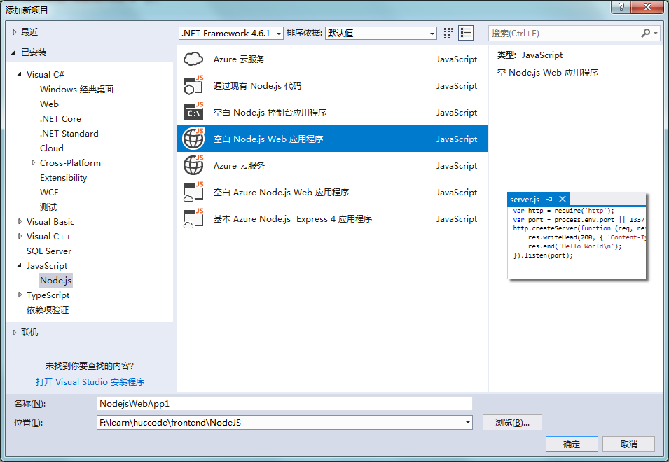

# 介绍

NodeJS是一个高性能的Web服务器，它有最重要的几大特点。

1. 单线程（不会为每个请求创建线程）
2. 异步IO
3. 事件驱动

[NodeJS的环境安装可以点我参考](../05/nodehuan-jing-da-jian.md)

[NodeJS的API](http://nodejs.cn/api/)

当应用程序需要处理大量并发IO操作，并不需要程序内部处理复杂的运算，这时候使用NodeJS是非常合适的。

比如：

* 聊天室
* 文件系统
* 考试系统

# HelloWord

新建一个js文件，HelloWord.js

	var http = require("http");
	http.createServer(function (req, res) {
	    res.writeHead(200, { "Content-Type": "text/html;charset=UTF-8" });
	    res.end("Hello Word\n");
	}).listen(3000,"127.0.0.1");

在当前文件目录打开命令行执行：

	node helloword.js

接下来打开浏览器输入：

	http://127.0.0.1:3000/

这样就可以看到输出了。node就是用来直接跑JS的一个平台。当我们需要修改输入内容之后每次都需要重启node服务器，比较麻烦，而且敲代码没有智能提示。

我们可以使用VS编辑器，

1. 添加新项目
2. JavaScript下的Node.js
3. 空白NodeJS新项目

这样就可以使用Ctrl+F5运行了。

> 后面升级完VS2017的node模块后，可能原有的git鼠标右键没有git barh了，这时候需要重新打开git安装包修改一下即可。