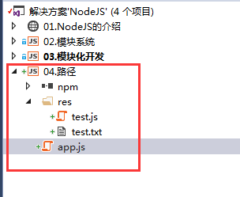
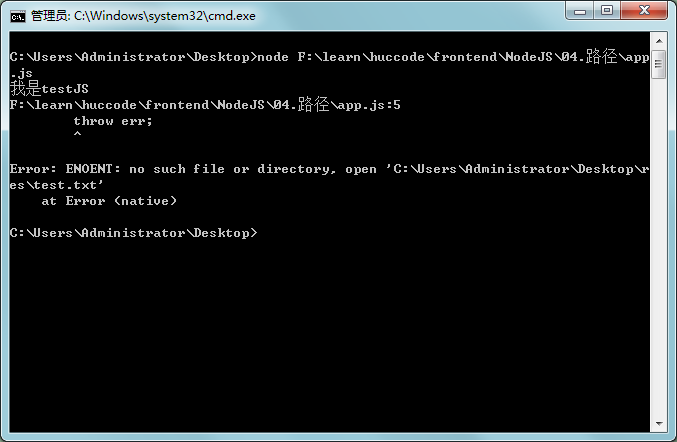

这个介绍**__dirname**这个成员

首先介绍一些整个环境的目录结构和代码：

app.js:

	require("./res/test.js");
	var fs = require("fs");
	fs.readFile("./res/test.txt", function (err,data) {
	    if (err) {
	        throw err;
	    }
	    console.log(data.toString());
	});

test.js:

	console.log("我是testJS");

test.txt:

	我是test文本

当我们在app.js同级目录打开CMD执行,是没有问题的：

	node app.js

如果CMD窗口是其他路径就会出错：

这里说明，require是从当前路径出发查找文件，

而fs模块是从CMD窗口光标位置出发查找。

为了开发中避免出现这样的错误，我们改写app.js:

	require("./res/test.js");
	var fs = require("fs");
	fs.readFile(__dirname+"/res/test.txt", function (err, data) {
	    if (err) {
	        throw err;
	    }
	    console.log(data.toString());
	});