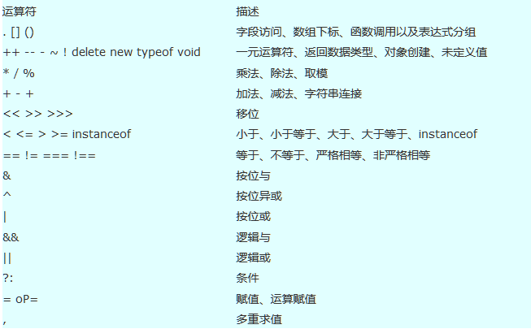

# 前言

当前章节将介绍表达式和运算符，以及运算符的优先级。

# 表达式

表达式是用于JavaScript脚本运行时进行计算的式子，可以包含常量、变量、运算符

下面的求圆面积的代码就是表达式的表现：

    

# 运算符

## 算术运算符

算术运算符有：+（加）、-（减）、*（乘）、/（除）、%（取余）、++（自增）、--（自减）等

### 加法（+）

> 只要+连接的操作数中有一个是字符串型，Js就会自动把非字符串型数据作为字符串型数据来处理
> 
> +连接的表达式中，遇到字符串型数据之前，所有出现的数值型数据(或者可以自动转换为数值型的数据)仍被作为数值来处理。为了避免这种情况，我们可以在表达式前拼一个空字符串

        var a = 17, b = -4,c=true,d="4";
        alert(a + b);//13
        alert(a + c);//18
        alert(a + d);//174

### 减法（-）

        var a = 17, b = -4;
        alert(a - b);//21

### 乘法（*）

        var a = 17, b = -4;
        alert(a * b);//-68

### 除法（/）

        var a = 17, b = -4;
        alert(a / b);//-4.25

### 取余（%）

取余，符号位以第一个数的符号位为准

        var a = 17, b = -4;
        alert(a % b);//1
        a = -17, b = 4;
        alert(a % b);//-1

### 自增（++）

后置自增，先执行表达式在自增。

        var a = 6;
        b = a++;
        alert(a);//7
        alert(b);//6

前置自增，先自增后执行

        var a = 6;
        b = ++a;
        alert(a);//7
        alert(b);//7

### 自减（--）

后置自减，先执行表达式在自减。

        var a = 6;
        b = a--;
        alert(a);//5
        alert(b);//6

前置自减，先自减后执行

        var a = 6;
        b = --a;
        alert(a);//5
        alert(b);//5

## 字符连接符

字符连接符也使用 + 号，它是string类型的一个重载运算符。

在使用连接符时需要注意和正常数值算术运算符之间的歧义。配合类型转换以及前一段落提到的算术运算符，应该很容易理解。

## 赋值运算符

赋值运算符有：=（等于）、+=（加等于）、-=（减等于）、*=（乘等于）、/=（除等于）、%=（取余等于）等

### 等于（=）

        var a = 16;
        alert(a);//16

### 加等于（+=）

        var a = 16, b = 1;
        b += a;
        alert(b);//17

可以理解为： b=b+a;

### 减等于（-=）

        var a = 16, b = 1;
        b -= a;
        alert(b);//-15

可以理解为： b=b-a;

### 乘等于（*=）

        var a = 16, b = 1;
        b *= a;
        alert(b);//16

可以理解为： b=b*a;

### 除等于（/=）

        var a = 16, b = 1;
        b /= a;
        alert(b);//0.0625

可以理解为： b=b/a;

### 取余等于（%=）

        var a = 16, b = 1;
        b %= a;
        alert(b);//1

可以理解为： b=b%a;

## 比较运算符

> 比较运算符的结果只有true和false

比较运算符有：（>）大于、（<）小于、（>=）大于等于、（<= ）小于等于、（==）等于、（!=）不等于、（===）全等于、（!==）全不等

### 大于、小于、大于等于、小于等于

        console.log(15 > 15);//false
        console.log(15 >= 15);//true
        console.log(15 < 15);//false
        console.log(15 <= 15);//true

### 等于和不等于

        console.log(1 == true);//true
        console.log(1 != true);//false

数值类型和boolean类型之间的运算涉及到隐式类型转换，0即假非0即真。

### 全等于和全不等于

        console.log(1 === true);//false
        console.log(1 !== true);//true

全等于比较了数值还有数据类型，等于只比较值。

## 逻辑运算符

逻辑运算符有：&&（逻辑与）、||（逻辑或）、！（逻辑非）

### 逻辑与（&&）

所有表达式为真，结果为真，否则为假

        console.log(true && true);//true
        console.log(true && false);//false
        console.log(false && true);//false
        console.log(false && false); //false

短路现象:

        var a = 0, b = 1;
        console.log(a-- && b++);//false
        alert(a);//-1
        alert(b);//1

第一个表达式为假之后，后面的表达式不会被执行

### 逻辑或（||）

只要有一个表达式为真，结果为真，否则为假

        console.log(true || true);//true
        console.log(true || false);//true
        console.log(false || true);//true
        console.log(false || false); //false

短路现象:

        var a = 0, b = 1;
        console.log(--a || b++);//true
        alert(a);//-1
        alert(b);//1

第一个表达式为真之后，后面的表达式不会被执行

### 逻辑非（!）

对表达式结果取反。

        console.log(!true);//false
        console.log(!false);//true

## 三目运算符

三目运算符只有一个，语法：

	表达式？结果1:结果2

当表达式的为true，返回结果1，否则返回结果2

        alert(true ? "真" : "假");//真

## 其他运算符

其他运算符有：逗号运算符、void运算符、typeof运算符

        var a = (b=3, c=5, d=9);
        alert(a);//9
        a = void (b = 3, c = 5, d = 9);
        alert(a);//undefined
        alert(typeof 10);//number

# 运算符的优先级

查看下表：

可以通过括号来改变运算符的优先级

# 总结

需要注意的点：

1. +号在数值和字符串中运算的区别
2. 取余运算符符号位的注意点
3. 等于和全等于的区别
4. 逻辑与和逻辑或造成短路现象
