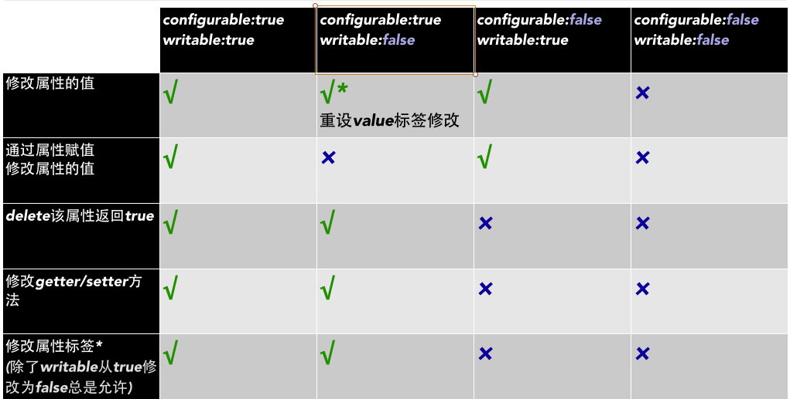

# 前言

这节需要掌握的的知识点有：

* 属性的六种特性
 * writable
 * enumerable
 * configurable
 * value
 * get
 * set
 
* 属性的一些操作符、方法，和它们之间的区别
	* defineProperty、definePropertys
	* getOwnPropertyDescriptor
	* in、hasOwnProperty、propertyIsEnumerable
	* for in、keys、 getOwnPropertyNames

# 属性的六种特性

> 属性有六种特性：writable、enumerable、configurable、value、get和set。
> 
> 使用字面量、构造函数等方式创建的对象属性，属性特性默认值都是true
> 
> 如果需要更改指定特性的值需要使用defineProperty或者definePropertys方法
> 
> 使用defineProperty定义的属性，不指定特性的值默认都是false
> 
> 需要查看某个属性的特性信息需要使用getOwnPropertyDescriptor方法
> 
> 如：Object.getOwnPropertyDescriptor(需要查看的对象名, "属性名")

下面将详细讲解每一种特性。

## writable

标识属性值是否能被修改。为false时，值是不能被修改的。

正常情况下，如：

        var obj = { x: 1 };
        console.log(obj.x);//1
        obj.x = 10;
        console.log(obj.x);//10

改变属性x的writable特性：

        var obj = { x: 1 };
        console.log(obj.x);//1

        Object.defineProperty(obj, "x", {
            writable:false
        });

        obj.x = 10;
        //修改不成功了
        console.log(obj.x);//1

## enumerable

标识属性是否可以被枚举，即是否可以被for-in遍历

    

## value

这就是属性的值，不存在的属性那么value就是undefined。

## configurable

标识属性是否可配置，是否可以被delete。

示例一：

    

如果想要可以做delete操作需要将configurable设置为true：

    

如果想修改y的值，可以直接设置writable。当不能直接修改源码的情况下，可以使用扩展：

    

## get和set

就算是通过set给属性赋值，也必须要属性的writable是可写状态。

    

## 汇总图

# 属性操作符

## defineProperty和definePropertys

用于定义对象属性，可以设置特性，默认属性的三个特性都是false。

即：不可写、不可配置、不可枚举

    

## getOwnPropertyDescriptor

用来获取指定属性的描叙信息,描叙信息包括：属性的6个特性。

> 只获取对象的属性，不包括原型属性
> 
> skinColor原型属性就获取不到

        //{value: "Jack", writable: true, enumerable: true, configurable: true}
        console.log(Object.getOwnPropertyDescriptor(jack, "name"));
        //undefined
        console.log(Object.getOwnPropertyDescriptor(jack, "skinColor"));
        //{value: undefined, writable: true, enumerable: true, configurable: false}
        console.log(Object.getOwnPropertyDescriptor(jack, "age"));
        //{value: undefined, writable: true, enumerable: false, configurable: false}
        console.log(Object.getOwnPropertyDescriptor(jack, "height"));
        //{value: undefined, writable: false, enumerable: false, configurable: false}
        console.log(Object.getOwnPropertyDescriptor(jack, "test"));

## in

判断对象是否包含该属性

> 包括对象的原型属性
> 
> skinColor原型属性也返回true

        //true
        console.log("name" in jack);
        //true
        console.log("skinColor" in jack);
        //true
        console.log("age" in jack);
        //true
        console.log("height" in jack);
        //true
        console.log("test" in jack);

## hasOwnProperty

判断对象是否包含该属性

> 不包括对象的原型属性
> 
> skinColor原型属性返回false

        //true
        console.log(jack.hasOwnProperty("name"));
        //false
        console.log(jack.hasOwnProperty("skinColor"));
        //true
        console.log(jack.hasOwnProperty("age"));
        //true
        console.log(jack.hasOwnProperty("height"));
        //true
        console.log(jack.hasOwnProperty("test"));

## propertyIsEnumerable

判断对象属性是否可以枚举

> 只有属性是对象自己的并且可以枚举才返回true
> 
> skinColor原型属性返回false

        //true
        console.log(jack.propertyIsEnumerable("name"));
        //false
        console.log(jack.propertyIsEnumerable("skinColor"));
        //true
        console.log(jack.propertyIsEnumerable("age"));
        //false
        console.log(jack.propertyIsEnumerable("height"));
        //false
        console.log(jack.propertyIsEnumerable("test"));

## for in

遍历对象的所有可以枚举的属性

> 首先遍历对象自己的属性，在遍历它的原型属性
> 
> skinColor原型属性也被遍历出来了

        //name  age skinColor
        for (var item in jack) {
            console.log(item);
        }

## keys

获取对象所有可以枚举的属性名

> 不包括原型属性
> 
> skinColor原型属性没有被遍历出来

        //(2) ["name", "age"]
        console.log(Object.keys(jack));

## getOwnPropertyNames

获取对象所有属性名，不可枚举的属性名也会得到

> 不包括原型属性
> 
> skinColor原型属性没有被遍历出来

        //(4) ["name", "age", "height", "test"]
        console.log(Object.getOwnPropertyNames(jack));

# 总结

对象的特性：

* 对象的属性有六个特性：writable、configurable、enumerable、value、get和set
* 字面量，构造函数创建的对象属性特性默认都是true
* defineProperties创建的属性特性不指定为true的话，默认都是false。
* 需要掌握writable和configurable的特点，以及它们组合之后的一些现象，那张图就是最好的总结

对象的方法：

* 使用defineProperty、definePropertys方法定义对象的属性可以配置其特性
* getOwnPropertyDescriptor可以获取对象自身属性的信息，不包含原型属性

遍历对象属性：

* keys可以获取对象自身所有可以枚举的属性名，不包含原型属性
* getOwnPropertyNames可以获取对象自身所有的属性名，不包含原型属性
* for in可以对象所有可以枚举的属性名，包含原型属性

属性的方法：

* in 判断一个属性是否属于该对象，包含原型属性
* hasOwnProperty判断一个属性是否属于该对象，不包含原型属性
* propertyIsEnumerable判断一个属性是否可枚举，不包含原型属性

重点需要学会使用这些方法，并且理解这些方法之间的区别，一般带Own的方法都只包含自身，不包括原型属性。