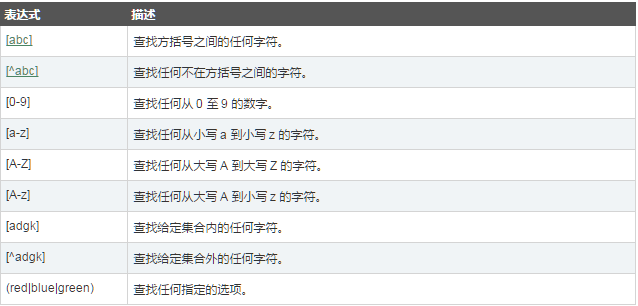
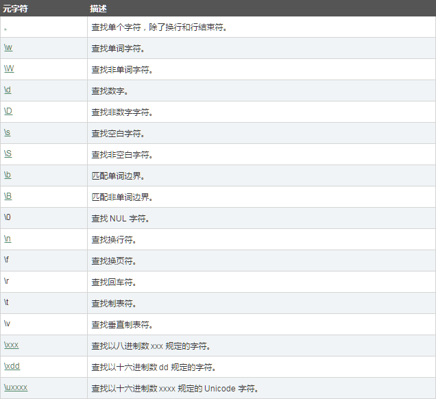
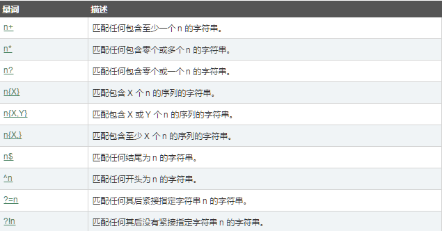

# 前言

这节将介绍正则表达式的用法，具体知识点包括:

* 正则的修饰符
* 正则的表达式
* 正则的元字符
* 正则的量词
* 实战各种常用正则

# 正则表达式语法

定义一个正则表达式有两种语法：

语法一：

	var patt=new RegExp(pattern,modifiers)

语法二：

	var patt=/pattern/modifiers;

# RegExp对象的方法

* test：每次执行test函数都只查找最多一个匹配，找到返回true，否则false
* exec：如果设置修饰符g，那么每次返回一个匹配项，第二次从第一次的结尾继续开始查找。否则和test一样的效果

# 正则的修饰符

正则的修饰符（modifiers）有三种,如图:

## i

忽略大小写进行正则匹配

    

## g

进行全局匹配，执行第一次返回第一个匹配项，执行第二次返回第二个匹配项

    

## m

执行多行匹配，只有正则使用^$的方式才起作用，其它形式加不加m都会进行多行匹配

比如：

需要匹配的字符串：

	var str = "JavaScript\nJava\nC#\nRuby\nJkkJa";

1. 正则表达式

	    

**必须加g参数，不然就会造成死循环，至于原因请查看上面介绍的test和exec的区别**

**上面的例子只能匹配到一个匹配项，index是0，\n换行之后就没有匹配了**

2. 正则表达式

	    

**加了m参数可以进行多行匹配，这样就能正常匹配到两个结果了**

# 正则的表达式

这里主要介绍方括号的用法，可以参考下表：

    

# 正则的元字符

主要介绍一些元字符

经常用到的也就是：

* 大小w
* 大小s
* 大小d
* 点
* \n

**快速记忆这些元字符，大写标识非，小写正常，w标识字符（word），d标识数字（digit），s标识空白字符（space）**

# 正则的量词

介绍正则的量词

快速记忆的方法：

* +:一至多个，加上至少有1，这个没有方便的记忆方法，只要死记之后和星号区分
* *：零至多个，星号可以为零
* ？：零至一个，可以看成三目运算符条件非只包含0和1
* {X}:包含X个
* {X,}:包含至少有X个，看表达式也知道第一个是范围的开始，范围结束没有上线
* {X,Y}:包含X至Y个，看表达式范围
* ^n:以n开头
* n$:以n结尾

# 实战各种常用正则

	

# 总结

需要掌握：

* test和exec的区别,exec使用时用g修饰过和不用g修饰的区别，避免死循环
* igm三个修饰符起到的作用
* 方括号起到的作用
* 元字符的记忆方式
* 量词的记忆方式
* 记录了开发中常用的正则，如验证：用户账号、密码、手机号、电话号、邮编、邮箱、身份证、验证码、整数、正整数、浮点数、正浮点数、IP地址、前后不能有空格的字符串
