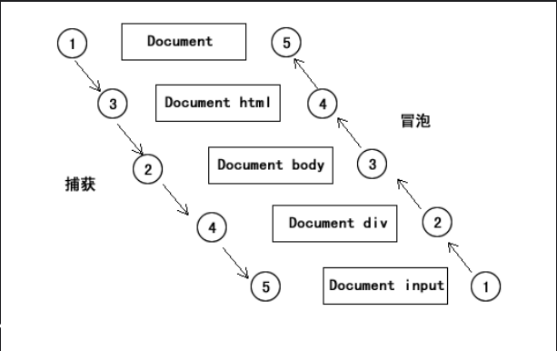

# 简言

这节需要讨论的知识点有：

1. 事件的定义
2. 事件的三种写法
3. 事件流

# 事件的定义

JavaScript中的事件指的是文档或者浏览器窗口中发生的一些特定交互瞬间。我们可以通过侦听器（或者处理程序）来预定事件，以便事件发生的时候执行相应的代码。

# 事件的三种写法

在JavaScript中事件有三种写法：内联模式、脚本模式、DOM2模式

## 内联模式

    <input type="button" value="内联模式" onclick="alert('内联模式按钮点击事件');" />

内联模式的写法基本都会弃用，因为它将脚本和html页面紧耦合了，不好维护

## 脚本模式

	<!DOCTYPE html>
	<html>
	<head>
	    <title></title>
	    
	</head>
	<body>
	    <input type="button" value="脚本模式" onclick="test()" />
	</body>
	</html>

这种方式同样也存在耦合性的问题

## DOM2模式

	<!DOCTYPE html>
	<html>
	<head>
	    <title></title>
	    
	</head>
	<body>
	    <input type="button" value="DOM2模式" id="btn" />
	</body>
	</html>

# 事件流

目前市面上所有浏览器的事件流指的都是事件冒泡，只有早起的Netscape浏览器的事件流才是捕获流。看下图：

## 冒泡的实现

根据上图的流程，我们实现一个事件冒泡：

	<!DOCTYPE html>
	<html>
	<head>
	    <title></title>
	    
	</head>
	<body>
	    

	        <input type="button" value="事件冒泡测试" id="btn" />
	    

	</body>
	</html>

## 阻止冒泡

阻止事件冒泡需要用到事件对象(event)中的方法。

	<!DOCTYPE html>
	<html>
	<head>
	    <title></title>
	    
	</head>
	<body>
	    

	        <input type="button" value="事件冒泡测试" id="btn" />
	    

	</body>
	</html>

# 总结

需要理解如下知识点：

1. 理解事件冒泡的原理
2. 如何阻止事件冒泡，并且掌握兼容性的解决方案
