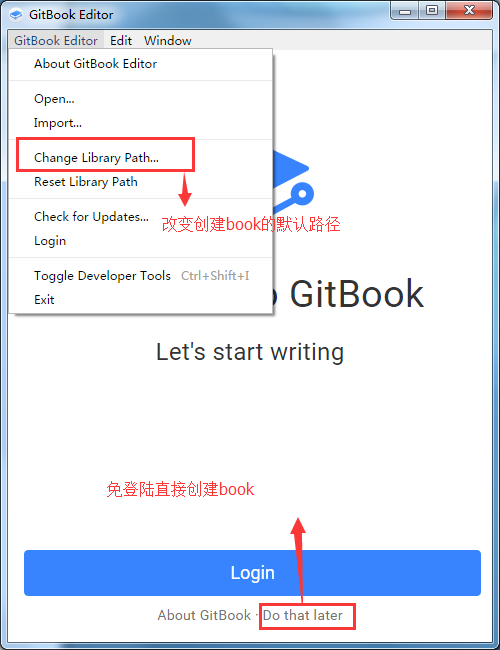

# 前言

这篇介绍如何使用GitBookEditor可视化编辑器来编写文档。

# 安装

官网下载地址：[点我下载](https://www.gitbook.com/editor/windows)

本地下载地址：[点我下载](assets/GitBook.Editor.Setup.exe)

下载完成后默认安装即可。

# 如何使用

首先打开gitbook editor编辑器会出现如下界面。



我们需要使用github来存储文档，所以这里不用创建book的方式

## 创建远程仓库

登录到github上创建一个远程仓库，地址:[https://github.com](https://github.com)

创建成功之后会得到一个地址，在通过git把仓库克隆到本地

```
git clone 远程仓库地址
```

## 打开仓库

通过gitbook editor的open打开刚才克隆下来的仓库。

打开之后就可以正常编辑你的文档了。当然，编辑器中还有许多的选项配置，具体需要自行摸索，重点都已经圈起来了


## 如何build

当文档编写完成之后，如何将其导出为html呢？？

需要根据 [gitbook篇](gitbook.md) 中，安装gitbook。

安装：


```
npm install gitbook-cli -g
npm install gitbook -g
```
检查版本：

```
gitbook -V
```

当环境安装完成之后，只需要在当前根目录执行

```
gitbook serve -p 4000
```

根据提示打开 http://localhost:4000 ,文档就呈现出来了。

# 插件篇

参考文档1：[http://gitbook.zhangjikai.com/plugins.html](http://gitbook.zhangjikai.com/plugins.html)

参考文档2：[https://chrisniael.gitbooks.io/gitbook-documentation/content/build/index.html](https://chrisniael.gitbooks.io/gitbook-documentation/content/build/index.html)

参考文档3：[http://www.chengweiyang.cn/gitbook/gitbook.com/edit.html](http://www.chengweiyang.cn/gitbook/gitbook.com/edit.html)

首先需要在根目录创建一个book.json的文件，以anchor-navigation-ex插件为例，

插件地址：[https://github.com/zq99299/gitbook-plugin-anchor-navigation-ex](https://github.com/zq99299/gitbook-plugin-anchor-navigation-ex)


book.json


```
{
  "gitbook": "3.2.2",
  "language": "zh-hans",
  "plugins": [
    "anchor-navigation-ex",
    "-sharing"
  ],
  "pluginsConfig": {
    "anchor-navigation-ex": {
      "showLevel": true,
      "associatedWithSummary": true,
      "mode": "float",
      "float": {
        "showLevelIcon": false,
        "level1Icon": "fa fa-hand-o-right",
        "level2Icon": "fa fa-hand-o-right",
        "level3Icon": "fa fa-hand-o-right"
      },
      "pageTop": {
        "showLevelIcon": false,
        "level1Icon": "fa fa-hand-o-right",
        "level2Icon": "fa fa-hand-o-right",
        "level3Icon": "fa fa-hand-o-right"
      }
    }
  }
}
```
-sharing表示不使用分享功能。book.json配置好之后需要在根目录执行

```
gitbook install
```
最后启动 

```
gitbook serve
```

我的book.json


```
{
    "title": "Node环境下的组件使用",
    "gitbook": "3.2.2",
    "language": "zh-hans",
    "plugins": [
        "anchor-navigation-ex",
        "emphasize",
        "splitter",
        "expandable-chapters-small",
        "multipart",
        "prism",
        "-highlight",
        "-sharing"
    ],
    "pluginsConfig": {
        "prism": {
            "css": [
              "prismjs/themes/prism-okaidia.css"
            ]
          },
        "anchor-navigation-ex": {
                "showLevel": true,
                "associatedWithSummary": true,
                "mode": "float",
                "float": {
                    "showLevelIcon": false,
                    "level1Icon": "fa fa-hand-o-right",
                    "level2Icon": "fa fa-hand-o-right",
                    "level3Icon": "fa fa-hand-o-right"
                },
                "pageTop": {
                    "showLevelIcon": false,
                    "level1Icon": "fa fa-hand-o-right",
                    "level2Icon": "fa fa-hand-o-right",
                    "level3Icon": "fa fa-hand-o-right"
                }
        }
    }
}

```


